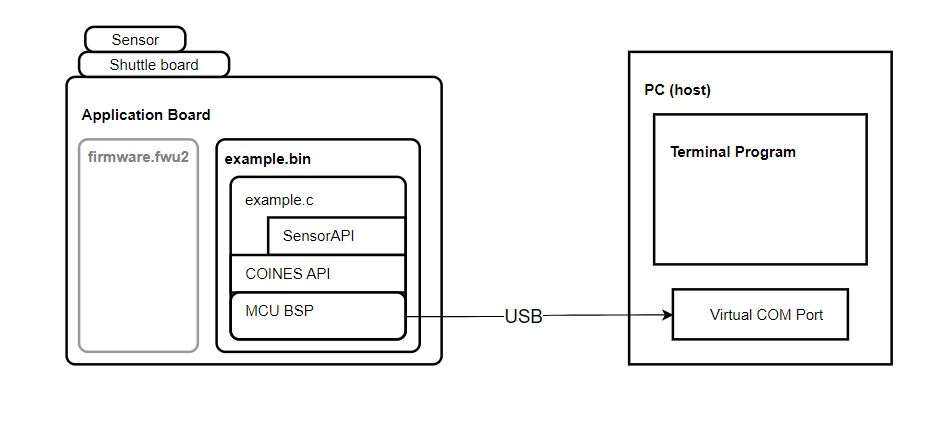

# Running examples directly on the MCU of the Application board

The examples can also be cross-compiled on PC side and downloaded into the memory of the Application board and executed there.
The user can choose to download the created binary into the flash memory or into the RAM (if the binary is not too big).

Important is that the example is placed in a location in the flash memory other than where the default firmware is stored.
The example is executed with a specific command, allowing to jump to the start address of the complied example from the default firmware.
As the firmware itself is not overwritten, the board always returns to its default state after a power-off-power-on cycle.

In this configuration the COINES layer provides a simple abstraction on top of the MCU BSP (i.e. board level support layer of the microcontroller).
Any printf command will now not output to the console, but rather to the USB connection, which appears as virtual COM port on PC side.

This mode allows to also perform many time-critical operations on the sensor, such as fast reading of FIFO content at high data rates.

  
  Fig. 5: Working principle: running example on the MCU of the Application Board
