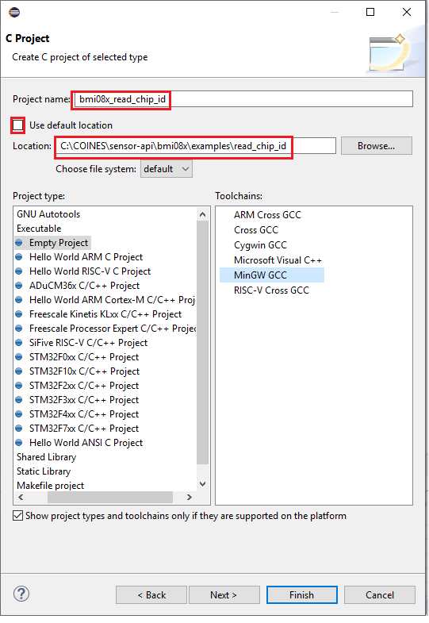
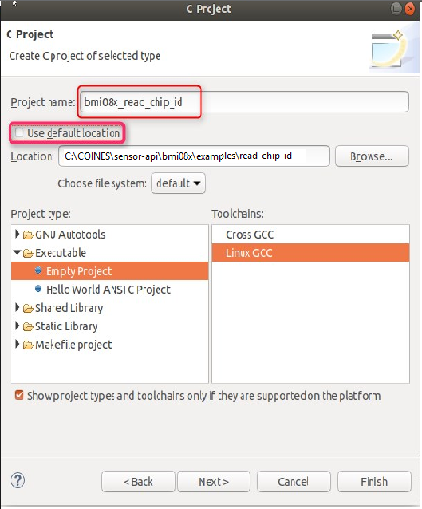
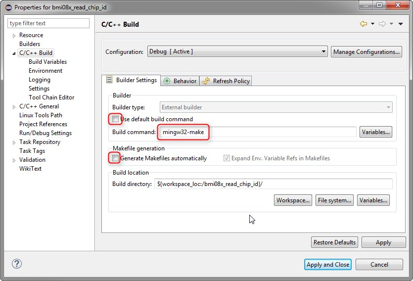
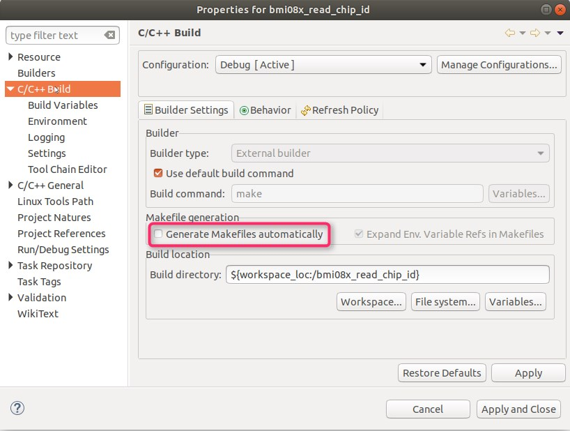
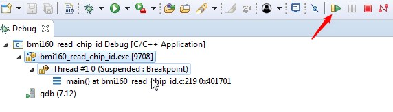

# Eclipse project for examples

- Open Eclipse
- Click File --> New --> C/C++ Project
	1. Input Project name --> Uncheck use default location --> Provide the location of the example folder
    
        
        Fig. 8: Eclipse C Project for Windows
    
    
        
        Fig. 9: Eclipse C Project for Linux
    

	2. Select Executable --> Empty project in Project type		
	3. For Windows, Select MinGW GCC as Toolchain
	4. For Linux, Select Linux GCC as Toolchain		

- In Project Explorer window, Right click on the project created --> Click Properties --> C/C++ Build --> Tool Chain Editor --> Select Current builder as Gnu Make Builder
- Again click on C/C++ Build
	1. For Windows, Uncheck `"Use default build command"` and type build command as `mingw32-make`
	2. Uncheck generate Makefiles automatically 
	3. Ensure Build location path is chosen from the workspace
	

        
        Fig. 10: Windows Eclipse Project Properties
    
    

        
        Fig. 11: Linux Eclipse Project Properties
    
    
	4. Click Apply and Close button

## Build project

In Project Explorer window, Right click on the project --> Click Build Project. The executable file will be generated.

## Debug project

- Click on Run --> Debug As --> Local C/C++ Application
- Once launching is completed, Click on 
    1. Resume button to run the application
    2. Terminate button to stop running the application

  
  Fig. 12: Eclipse Debug Configuration

