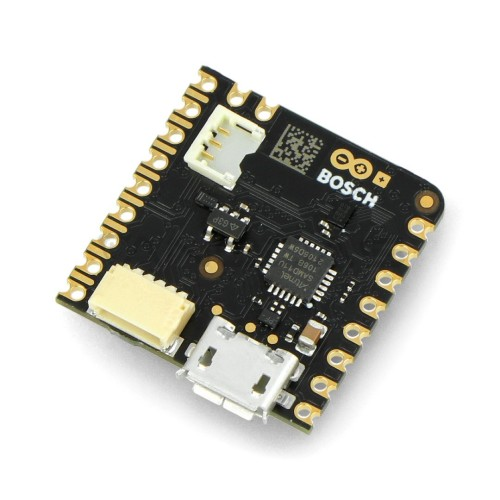
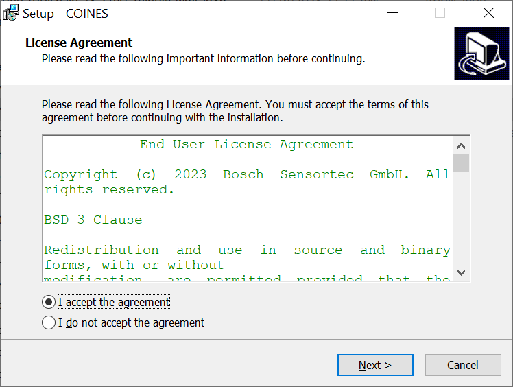
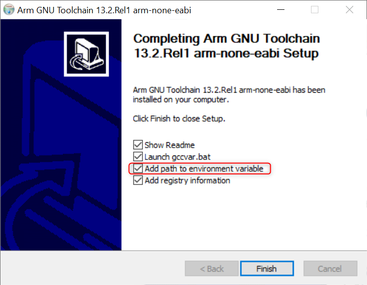
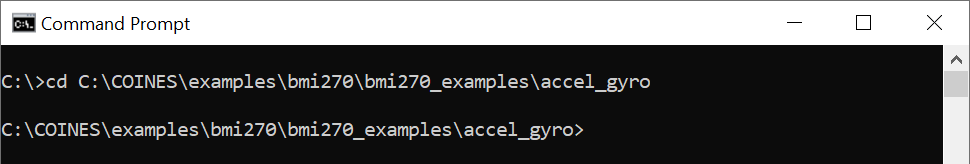
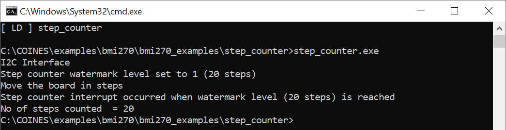
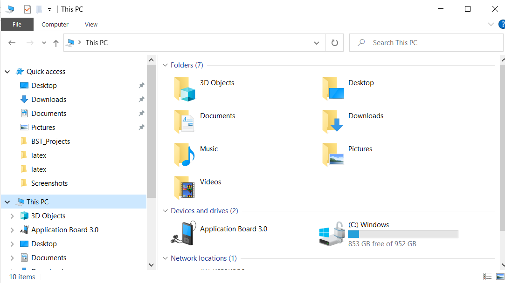

# Introduction

Bosch Sensortec offers a toolkit for evaluation of it's sensor
products.The toolkit consists of 3 elements:

1.  **Engineering board**: [Application
    Board](https://www.bosch-sensortec.com/bst/support_tools/application_boards/overview_application_boards)
    named APP2.0 and APP3.x in this document, serves as interface
    translator from the sensor interface (I^2^C or SPI) to a USB
    interface, allowing PC software to communicate with the sensor on
    the shuttle board. [Nicla Sense
    ME](https://store.arduino.cc/products/nicla-sense-me) board combines
    four state-of-the-art sensors from Bosch Sensortec (BHI260AP,
    BMP390, BMM150 and BME688) in the Arduino ecosystem.

    <figure>
    <div class="center">
    <p>   </p>
    </div>
    <figcaption>Application Board 2.0/3.0/3.1/Nicla Sense ME</figcaption>
    </figure>

2.  **Sensor Shuttle board**: A sensor specific shuttle board also known
    as breakout board is a PCB with the sensor mounted on it. The
    shuttle board allows easy access to the sensor pins via a simple
    socket and can be directly plugged into the Bosch Sensortec's
    Application boards. APP3.x shuttle boards also known as mini shuttle
    boards has smaller form factor when compared with APP2.0 shuttle
    board.

    <figure>
    <div class="center">
    <p> </p>
    </div>
    <figcaption>APP2.0/3.x sensor shuttle board</figcaption>
    </figure>

3.  **COINES**: COINES provides a low-level interface for communication
    with Bosch Sensortec's Engineering boards enabling access to their
    MEMS sensors through sample applications and SensorAPI. For detailed
    description, refer to sections below.

# Introduction to COINES

COINES (\"**CO**mmunication with **IN**ertial and **E**nvironmental
**S**ensors\") is an SDK (Software Development Kit), implemented in C as
a programming language that provides a low-level interface to Bosch
Sensortec's Engineering Boards. The user can access Bosch Sensortec's
MEMS sensors through this C interface. COINES can be used with the
SensorAPI of the sensor which is available at
<https://github.com/BoschSensortec>. The user can modify, compile and
run the sample applications in COINES SDK and SensorAPI.

The full working environment consists of:

-   A Bosch Sensortec MEMS sensor on a shuttle board mounted on the
    socket of Bosch Sensortec's Application board APP2.0/APP3.x

-   Windows, Linux or Mac PC to which the Engineering Board is connected
    via USB or BLE.

-   The release of the COINES software is available at
    <https://www.bosch-sensortec.com/software-tools/tools/coines/>

-   C compiler is also required (for details, see sections below)

# COINES usage

The following diagram represents COINES usage.

<figure>
<div class="center">

</div>
<figcaption>COINES usage with APP3.1</figcaption>
</figure>

# Installation

COINES should be usable on any recent PC or laptop system which has at
least a performance as an "office PC". The hardware should provide a USB
interface.

COINES runs on recent versions of Windows, Linux and Mac Operating
systems.

## Installation (Windows)

### System requirements

The supported OS versions are Windows 10 and 11.

### Installation of COINES

The steps below need to be followed in order to install COINES SDK:

1.  Download the latest version of COINES from [Bosch Sensortec
    website](https://www.bosch-sensortec.com/software-tools/tools/coines/)

2.  Run the Installer

3.  Accept the End User License Agreement and click Next

    <figure>
    <div class="center">
    
    </div>
    <figcaption>Windows installer end user agreement dialog</figcaption>
    </figure>

4.  Click Install to start Installation

    <figure>
    <div class="center">
    
    </div>
    <figcaption>Windows install dialog</figcaption>
    </figure>

### Installation of compiler environment

COINES examples can be built using GNU C compiler (GCC). There are
various distributions of GCC. TDM-GCC is easy to install and hence
preferred for COINES. TDM GCC is based on MinGW GCC.

If you have already installed GCC (MinGW/Cygwin/MSYS2 GCC) and added to
'PATH' environmental variable, you can skip compiler installation.

The steps to install compiler environment are as follows:

1.  Download the TDM32/TDM64 bundle
    ([link](http://tdm-gcc.tdragon.net/)). **Use TDM32 bundle if your
    Windows OS is 32-bit and TDM64 bundle if 64-bit.**

2.  Start the Installer. Ensure that the option Check for updated files
    on the TDM GCC server is unchecked. Click Create and proceed with
    the installation

3.  If you intend to do run the COINES example on Application Board's
    microcontroller, install the latest version of [GNU Embedded
    Toolchain for
    ARM](https://developer.arm.com/downloads/-/arm-gnu-toolchain-downloads)
    for Windows. Make sure you have checked 'Add to PATH'.

<figure>
<div class="center">

</div>
</figure>

<figure>
<div class="center">

</div>
<figcaption>TDM-GCC installation dialog</figcaption>
</figure>

<figure>
<div class="center">

</div>
<figcaption>GNU ARM Toolchain installation</figcaption>
</figure>

## Installation (Linux/MacOS)

### System requirements

-   The supported Linux OS versions are Debian based - Ubuntu 18.04 and
    22.04.

-   The supported macOS versions are MacOS Ventura 13.4.1 and 13.5.2.

### Installation of COINES

The steps below need to be followed in order to install COINES SDK:

1.  Download the installer.

2.  Use the command `cd` to go to the directory where the installer is
    located and make the installer executable:

    -   `chmod +x coines_vX.Y.sh`

3.  Ensure that you are connected to the Internet before running the
    installer, which is executed like this:

    -   `./coines_vX.Y.sh`

4.  Accept the End User License agreement

    <figure>
    <div class="center">
    
    </div>
    </figure>

    <figure>
    <div class="center">
    
    </div>
    <figcaption>Linux installer end user agreement</figcaption>
    </figure>

5.  The installer will prompt you if the required dependencies/packages
    are not installed. (This step requires root privileges.)

### Installation of compiler environment

On a Debian or Redhat based Linux distro, the installer prompts for
installation of missing dependencies, `gcc`, `make` and `libusb-dev`
packages.If due to some reason installation fails, the user can manually
install the dependencies.

-   Debian based distros - `gcc`, `make`, `libusb-1.0-0-dev`, `dfu-util`
    , `libdbus-1-dev`

-   Redhat based distros - `gcc`, `make`, `libusbx-devel`, `dfu-util`,
    `dbus-devel`

-   MacOS - `libusb`, `dfu-util`

If you intend to run the COINES example on Application Board's
microcontroller, download the latest version of [GNU Embedded Toolchain
for
ARM](https://developer.arm.com/downloads/-/arm-gnu-toolchain-downloads)
for Linux and extract the package. Add the compiler to PATH variable by
editing `$HOME/.bashrc` or similar file like
`/etc/profile or /etc/environment`.

# Using COINES to access the sensor on Engineering Board {#coines}

## Running examples on the MCU of the Application board {#ExampleOnMCU}

### Working principle

The COINES SDK can be cross-compiled on PC side and downloaded into the
memory of the Application board and executed there. The user can choose
to download the created binary into the flash memory or into the RAM (if
the binary is within the RAM memory capacity e.g., APP3.x's RAM is 256
KB).

Downloading COINES SDK example to APP3.x Flash memory will overwrite
default firmware. To update the firmware again, refer to section
[13](#firmwareUpdate){reference-type="ref" reference="firmwareUpdate"}.

In this configuration, the COINES layer provides a simple abstraction on
top of the MCU BSP (i.e. board level support layer of the
microcontroller). Any `printf` command will now not output to the
console, but rather to the USB connection, which appears as virtual COM
port on PC side.

This mode facilitates the execution of many time-critical operations on
the sensor, such as fast reading of FIFO content at high data rates.

<figure>
<div class="center">

</div>
<figcaption>Working principle: Running example on the MCU of the
Application board</figcaption>
</figure>

### Getting started

To get started with example execution, follow these steps:

1.  Make sure that [GNU Embedded Toolchain for
    ARM](https://developer.arm.com/downloads/-/arm-gnu-toolchain-downloads)
    is installed on your PC and added to environmental variable `PATH`.

2.  Connect the Application board via USB, with the sensor shuttle board
    mounted.

3.  Open the command prompt or the terminal.

4.  Use the command `cd` to go to the directory where the example that
    is to be built is located.

### Interfacing via BLE

The procedure to interface via BLE involves these steps:

1.  Open the script to be executed (in case of SensorAPI - common.c file
    in the selected example folder) in your IDE

2.  Change COINES_COMM_INTF_USB to COINES_COMM_INTF_BLE

3.  Change all print statments

            printf(...) to fprintf(bt_w,...)

4.  Now follow the steps from 1 - 4 in the above section

### Cross compiling

To compile and download an example to Engineering Board's
microcontroller, type any of the build commands below based on available
Engineering board type and target memory location. Use '`mingw32-make`'
(TDM-GCC/MinGW) or '`make`' (Linux/Cygwin/MSYS2/MacOS) for compilation.

Note: Nicla board programs can only be executed as PC target at this
moment.

### Viewing the results

The ways to view the execution results are outlined as follows:

1.  Use a Serial Terminal application to view output.

    -   Windows - PuTTY, HTerm,etc.,

    -   Linux - `cat` command. Eg: `cat /dev/ttyACM0`

    -   macOS - `screen` command. Eg: `screen /dev/tty.usbmodem9F31`

    Note: The binary on the MCU will be executed once the serial port is
    opened. The port must be opened including DTR signal set, otherwise
    the binary will not be executed. Some terminal programs such as
    HTerm allow explicit setting of the DTR signal.

2.  For bluetooth communication, connect the Application board to
    another power source and keep it within the BLE range. And use any
    of the below tools to view the output.

    -   Android app - [Serial Bluetooth
        terminal](https://play.google.com/store/apps/details?id=de.kai_morich.serial_bluetooth_terminal)

    -   Website - [Web Device
        CLI](https://wiki.makerdiary.com/web-device-cli/)

    -   Python script -

### Data logging

The user can use any serial terminal program to access and store the
data provided via virtual COM port e.g HTerm has \"Save output\" option
to store log.

## Running examples on PC side

### Working principle

When compiling the COINES SDK for PC side, the COINES layer provides an
abstraction of the embedded environment on the host side. COINES library
provides read and write functions for I^2^C and SPI on PC side. These
functions receive the arguments of the user input (i.e. what register
address to read from) and tunnel them through the USB connection to the
Application Board, where they are fed into the embedded I^2^C and SPI
functions and are executed to access the sensor. Any result or response
from those functions is tunneled back to the PC side and provided to the
example application.

This approach allows easy and flexible programming and offers the
possibility to integrate the example code into other applications or add
advanced logging options. The drawback is that in this mode the code is
not executed in real time, as it runs on a multi-tasking operating
system. To overcome this drawback, the examples can also be run on the
MCU side (see section [5.1](#ExampleOnMCU){reference-type="ref"
reference="ExampleOnMCU"}).

<figure>
<div class="center">

</div>
<figcaption>Working principle: Running example on PC side</figcaption>
</figure>

### PC side implementation

This setup has the challenge of lacking the real-time capabilities known
from a pure microcontroller environment. To overcome this, the coinesAPI
offers streaming functions, which allow the user to schedule data
readout directly on the microcontroller, either based on a data
interrupt coming from the sensors or based on the timer of the
microcontroller. The scheduler waits for the configured interrupt
(sensor interrupt or timer interrupt) and reads out areas of the
register map, which can be configured by the user.

As an example, the user could choose to read out the 6 bytes from the
register map of a certain inertial sensor, containing the sensor data of
three axis (2 bytes per axis). If the user would configure e.g a readout
once per milliseconds, the result would be a data stream of three-axis
sensor data at a rate of 1 kHz.

### Getting started

To get started with example execution, follow these steps:

1.  Connect the Application board via USB, with the sensor shuttle board
    mounted.

2.  Refer to section [13](#firmwareUpdate){reference-type="ref"
    reference="firmwareUpdate"} and update the Coines Bridge firmware to
    the board.

3.  Open the command prompt or the terminal.

4.  Use the command `cd` to go to the directory where the example that
    is to be built is located.

Note: Some examples may not compile for both PC and MCU target. Please
refer to the example documentation or simply the example name (e.g.
examples that can only be compiled for the PC are named with a following
'\_pc').

### Interfacing via BLE

The procedure to interface via BLE involves these steps:

1.  Open the script to be executed (in case of SensorAPI - common.c file
    in the selected example folder) in your IDE

2.  Change COINES_COMM_INTF_USB to COINES_COMM_INTF_BLE

3.  Now follow the steps from 1 - 4 in the above section

### Compiling

To run an example in PC side, execute below command \"mingw32-make
TARGET=PC\". Use '`mingw32-make`' (TDM-GCC/MinGW) or '`make`'
(Linux/Cygwin/MSYS2/MacOS) for compilation.

### Viewing the results

Running the output executable in the command prompt of the PC will
display the results. To view ouput via BLE, connect the Application
board to another power source and keep it within the BLE range and run
the executable in the PC.

### Data logging

The user can utilize the terminal's output redirection command to store
the result of a command/executable in a file, as demonstrated below.

<figure>
<div class="center">

</div>
</figure>

## Project Cleanup

The commands to clean build files are listed below:

-   `mingw32-make clean` - Use this command to remove the object files
    and other intermediate files created during the compilation process.

-   `mingw32-make clean-all` - Use this command to remove all build
    artifacts, including the final executable or library, and start the
    build process from scratch

# Using COINESPY to access the sensor on Engineering Board

## Introduction to `COINESPY` library

The `COINESPY` library provides a Python interface for interacting with
the Bosch Sensortec's Engineering Boards. The library offers the
following range of functionalities:

-   Control VDD and VDDIO of sensor

-   Configure SPI and I^2^C bus parameters

-   Read and write into registers of sensors from Bosch Sensortec via
    SPI and I^2^C

-   Read and write digital pins of the Application Board

## Installation

The `COINESPY` module can be installed using pip:

    pip install coinespy

The module can be found on <https://pypi.org/project/coinespy/>. It is
highly recommended to test the following script
`examples\python\coinespy_test.py` in the COINES installation or Refer
to [8.2.1](#GettingBoardInfo){reference-type="ref"
reference="GettingBoardInfo"} to check if the installation was
successful.

# Using Sensor API with COINES

## SensorAPI

Bosch Sensortec recommends using the SensorAPI in order to communicate
with the sensors. The SensorAPI, an abstraction layer written in C makes
it much more convenient for the user to access the register map of the
sensor, in order to configure certain functionality and obtain certain
information from it.

For making use of the SensorAPI, some function pointers must be set to
the appropriate read/write functions of the selected bus on the system
(either I^2^C or SPI), as well as one function pointer to a system's
function causing delays in milliseconds.

In order to execute C code using SensorAPI, the COINES API provides the
mentioned read, write, delay functions. These functions are wrapper
functions, embedding the actual SensorAPI payloads into a transport
package, sending this via USB or BLE to the Engineering board, where the
payload is translated into corresponding SPI or I^2^C messages and sent
to the sensor on the shuttle board.The mapping would look similar to the
one below.

    #include "coines.h"
    #include "bst_sensor.h"

    struct bst_sensor_dev sensordev;
    ....
    ....
    sensordev.intf = BST_SENSOR_I2C_INTF;  // SPI - BST_SENSOR_SPI_INTF
    sensordev.read = coines_read_i2c;   // coines_read_spi
    sensordev.write = coines_write_i2c; // coines_write_spi
    sensordev.delay_ms = coines_delay_usec;

For the description of COINES functions used, refer to
[15.2](#CoinesCFunctions){reference-type="ref"
reference="CoinesCFunctions"}.

## Downloading Sensor API

In order to download SensorAPI, the steps below need to be followed:

-   Download SensorAPI repo using Download zip option for selected
    sensors from boschsensortec github
    <https://github.com/BoschSensortec>.

-   Unzip the downloaded SensorAPI repo to .

-   Rename the unzipped folder to sensor name e.g and change directory
    to an example folder to execute it.

## Running example on MCU side

Here are the step-by-step instructions to run examples on MCU side:

-   Selected Platform: Windows

-   Board: APP3.1

-   Sensor shuttle: BMI270

-   Example:

1.  Connect the Application Board board via USB, with the sensor shuttle
    board mounted.

2.  Open the command prompt or the terminal.

3.  Use the command `cd` to go to the directory where the example that
    is to be built is located.

    <figure>
    <div class="center">
    
    </div>
    </figure>

4.  Execute command \"mingw32-make TARGET=MCU_APP31 download\"

    <figure>
    <div class="center">
    
    </div>
    </figure>

    <figure>
    <div class="center">
    
    </div>
    </figure>

5.  View the output in a serial terminal application like HTerm

    <figure>
    <div class="center">
    
    </div>
    </figure>

    <figure>
    <div class="center">
    
    </div>
    </figure>

## Running example on MCU side via BLE

The sequence of actions required for interfacing via BLE includes the
steps below:

1.  Go to the folder in file explorer

2.  Open the common.c file in the selected example folder in your IDE

3.  Change COINES_COMM_INTF_USB to COINES_COMM_INTF_BLE

    <figure>
    <div class="center">
    
    </div>
    </figure>

4.  Open example script and change the

            printf(...) to fprintf(bt_w,...)

    <figure>
    <div class="center">
    
    </div>
    </figure>

5.  Now follow the same steps from 1 - 4 in the above section.

6.  Connect the Application board to another power source and keep it
    within the BLE range.

7.  View the output in the [Web Device
    CLI](https://wiki.makerdiary.com/web-device-cli/) site in your
    browser by connecting to board via BLE.

    <figure>
    <div class="center">
    
    </div>
    </figure>

    <figure>
    <div class="center">
    
    </div>
    </figure>

## Running example on PC side

Here are the step-by-step instructions to run examples on PC side:

-   Selected Platform: Windows

-   Board: APP3.1

-   Sensor shuttle: BMI270

-   Example:

1.  Connect the Application Board board via USB, with the sensor shuttle
    board mounted.

2.  Refer to section [13](#firmwareUpdate){reference-type="ref"
    reference="firmwareUpdate"} and update the Coines Bridge firmware to
    the board.

3.  Open the command prompt or the terminal.

4.  Use the command `cd` to go to the directory where the example that
    is to be built is located.

    <figure>
    <div class="center">
    
    </div>
    </figure>

5.  Execute command \"mingw32-make TARGET=PC
    COINES_BACKEND=COINES_BRIDGE\"

    <figure>
    <div class="center">
    
    </div>
    </figure>

6.  View the output in the command prompt by running the example
    executable.

    <figure>
    <div class="center">
    
    </div>
    </figure>

## Running example on PC side via BLE

The sequence of actions required for interfacing via BLE includes the
steps below:

1.  Go to the examples folder in file explorer.

2.  Open the common.c file in the selected example folder in your IDE.

3.  Change COINES_COMM_INTF_USB to COINES_COMM_INTF_BLE.

4.  Connect the Application board to another power source and keep it
    within the BLE range.

5.  Now follow the same steps from 3 - 6 in the above section.

    <figure>
    <div class="center">
    
    </div>
    </figure>

# Examples on how to use COINES

## COINES C examples

### Establishing communication

The following code snippet shows how to set up a connection with the
board.

``` {.c language="c"}
#include <stdio.h>
    #include <stdlib.h>
    
    #include "coines.h"
    
    int main(void)
    {
        int8_t error_code;
        enum coines_comm_intf comm_intf = COINES_COMM_INTF_USB;

        error_code = coines_open_comm_intf(comm_intf, NULL);
        if (error_code == COINES_SUCCESS)
        {
            printf("\nSuccessfully connected to board!\n");
        }
        else
        {
            printf("\nUnable to connect with board!\n");
            exit(error_code);
        }
    
        coines_close_comm_intf(comm_intf, NULL);
    
        return 0;
    }
```

The APIs below can be used for board interface.

-   `coines_open_comm_intf`

-   `coines_close_comm_intf`

### Getting board info

The following code snippet shows how to get board information.

``` {.c language="c"}
#include <stdio.h>
    #include <stdlib.h>
    
    #include "coines.h"
    
    int main(void)
    {
        int8_t error_code;
        struct coines_board_info board_info;
        enum coines_comm_intf comm_intf = COINES_COMM_INTF_USB;
    
        error_code = coines_open_comm_intf(comm_intf, NULL);
        if (error_code < COINES_SUCCESS)
        {
            printf("\nUnable to connect with board!\n");
            exit(error_code);
        }
    
        error_code = coines_get_board_info(&board_info);
        if (error_code == COINES_SUCCESS)
        {
            printf("\nBoard Info:");
            printf("\n\tboard_info.board:0x%02X", board_info.board);
            printf("\n\tboard_info.hardware_id:0x%02X", board_info.hardware_id);
            printf("\n\tboard_info.shuttle_id:0x%02X", board_info.shuttle_id);
            printf("\n\tboard_info.software_id:0x%02X", board_info.software_id);
        }
    
        coines_close_comm_intf(comm_intf, NULL);
    
        return 0;
    }
    
```

### I2C config and read

This basic program shows how to configure and perform I2C read. Sensor:
BMI270

``` {.c language="c"}
#include <stdio.h>
    #include <stdlib.h>
    
    #include "coines.h"
    
    #define BMI2_I2C_PRIM_ADDR  0x68
    
    int main(void)
    {
        int8_t error_code;
        uint8_t chip_id;
        uint8_t reg_addr = 0x0;
        enum coines_comm_intf comm_intf = COINES_COMM_INTF_USB;
    
        error_code = coines_open_comm_intf(comm_intf, NULL);
        if (error_code == COINES_SUCCESS)
        {
            printf("\nSuccessfully connected to board!\n");
        }
        else
        {
            printf("\nUnable to connect with board!\n");
            exit(error_code);
        }
    
        /* Power up the board */
        (void)coines_set_shuttleboard_vdd_vddio_config(3300, 3300);
        coines_delay_usec(200);
    
        /* SDO to Ground */
        coines_set_pin_config(COINES_SHUTTLE_PIN_22, COINES_PIN_DIRECTION_OUT, COINES_PIN_VALUE_LOW);
    
        /* Make CSB pin HIGH */
        coines_set_pin_config(COINES_SHUTTLE_PIN_21, COINES_PIN_DIRECTION_OUT, COINES_PIN_VALUE_HIGH);
        coines_delay_msec(100);
    
        /* SDO pin is made low */
        coines_set_pin_config(COINES_SHUTTLE_PIN_SDO, COINES_PIN_DIRECTION_OUT, COINES_PIN_VALUE_LOW);
    
        /* I2C config */
        coines_config_i2c_bus(COINES_I2C_BUS_0, COINES_I2C_STANDARD_MODE);
    
        /* I2C read */
        (void)coines_read_i2c(COINES_I2C_BUS_0, BMI2_I2C_PRIM_ADDR, reg_addr, &chip_id, 1);
    
        printf("I2C read: Sensor chip ID - 0x%x\n", chip_id);
    
        (void)coines_set_shuttleboard_vdd_vddio_config(0, 0);
        coines_delay_msec(100);
    
        /* Coines interface reset */
        coines_soft_reset();
        coines_delay_msec(100);
    
        coines_close_comm_intf(comm_intf, NULL);
    
        return 0;
    }
```

The user shall pass GPIO pin numbers, read register address and I2C
device address for sensors based on the selected sensor shuttle board.
I2C communication require the proper setting of VDD and VDDIO using
`coines_set_shuttleboard_vdd_vddio_config`. The APIs below can be used
for I2C configure/read/write.

-   `coines_config_i2c_bus`

-   `coines_read_i2c`

-   `coines_write_i2c`

### SPI config and read

This basic program shows how to configure and perform SPI read. Sensor:
BMI270

``` {.c language="c"}
#include <stdio.h>
    #include <stdlib.h>
    
    #include "coines.h"
    
    #define BMI2_SPI_RD_MASK  0x80
    
    int main(void)
    {
        int8_t error_code;
        uint8_t chip_id[2], dummy_byte;
    
        /* An extra dummy byte is read during SPI read */
        uint8_t dummy_byte_len = 1;
        uint8_t reg_addr = 0x0;
        enum coines_comm_intf comm_intf = COINES_COMM_INTF_USB;
    
        error_code = coines_open_comm_intf(comm_intf, NULL);
        if (error_code == COINES_SUCCESS)
        {
            printf("\nSuccessfully connected to board!\n");
        }
        else
        {
            printf("\nUnable to connect with board!\n");
            exit(error_code);
        }
    
        /* Power up the board */
        coines_set_shuttleboard_vdd_vddio_config(3300, 3300);
        coines_delay_msec(200);
    
        /* SPI config */
        (void)coines_config_spi_bus(COINES_SPI_BUS_0, COINES_SPI_SPEED_5_MHZ, COINES_SPI_MODE3);
    
        /* Pin config */
        coines_set_pin_config(COINES_SHUTTLE_PIN_21, COINES_PIN_DIRECTION_OUT, COINES_PIN_VALUE_HIGH);
    
        /* Mask read register address for SPI */
        reg_addr = (reg_addr | BMI2_SPI_RD_MASK);
    
        /* Dummy read for SPI init*/
        (void)coines_read_spi(COINES_SPI_BUS_0, COINES_MINI_SHUTTLE_PIN_2_1, reg_addr, &dummy_byte, 1);
        coines_delay_usec(450);
    
        /* SPI read */
        (void)coines_read_spi(COINES_SPI_BUS_0, COINES_MINI_SHUTTLE_PIN_2_1, reg_addr, chip_id, 1 + dummy_byte_len);
        coines_delay_usec(450);
    
        printf("SPI read: Sensor chip ID - 0x%x\n", chip_id[dummy_byte_len]);
    
        (void)coines_set_shuttleboard_vdd_vddio_config(0, 0);
        coines_delay_msec(100);
    
        /* Coines interface reset */
        coines_soft_reset();
        coines_delay_msec(100);
    
        coines_close_comm_intf(comm_intf, NULL);
    
        return 0;
    }
```

The user shall pass GPIO pin numbers, read register address and SPI CS
pins for sensors based on the selected sensor shuttle board. SPI
communication require the proper setting of VDD and VDDIO using
`coines_set_shuttleboard_vdd_vddio_config`. The APIs below can be used
for SPI configure/read/write.

-   `coines_config_spi_bus`

-   `coines_read_spi`

-   `coines_write_spi`

### Led and button control

The example program below is to control LEDs and buttons on the board.
Target: MCU

``` {.c language="c"}
#include <stdio.h>
    #include <stdbool.h>
    #include "coines.h"
    
    /* Callback for button 1 interrupt */
    static void button1CB(uint32_t param1, uint32_t param2);
    
    /*Callback for button 1 event */
    void button1CB(uint32_t param1, uint32_t param2)
    {
        (void)param1;
        (void)param2;
    
        coines_set_led(COINES_LED_RED, COINES_LED_STATE_ON);
        coines_set_led(COINES_LED_GREEN, COINES_LED_STATE_OFF);
        coines_set_led(COINES_LED_BLUE, COINES_LED_STATE_ON);
    }
    
    int main(void)
    {
        coines_open_comm_intf(COINES_COMM_INTF_USB, NULL);
    
        coines_set_pin_config(COINES_APP30_BUTTON_1, COINES_PIN_DIRECTION_IN, COINES_PIN_VALUE_HIGH);
        coines_attach_interrupt(COINES_APP30_BUTTON_1, button1CB, COINES_PIN_INTERRUPT_FALLING_EDGE);
    
        coines_close_comm_intf(COINES_COMM_INTF_USB, NULL);
    
        return 0;
    }
```

### File listing in External memory

To list the files in the external memory, below snippet can be used.
Target: MCU

``` {.c language="c"}
#include <stdio.h>
    #include "coines.h"
    
    int main(void)
    {
        coines_open_comm_intf(COINES_COMM_INTF_USB, NULL);
        DIR *directory;
        struct dirent *dir;
        directory = opendir(".");
        if (directory)
        {
            while ((dir = readdir(directory)) != NULL)
            {
                printf("%s\n", dir->d_name);
            }
    
            closedir(directory);
        }
    
        coines_close_comm_intf(COINES_COMM_INTF_USB, NULL);
    
        return 0;
    }
```

### Temperature measurement

This simple program demonstrates how to measure temperature of the
board. Target: MCU

``` {.c language="c"}
#include <stdio.h>
    #include <stdlib.h>

    #include "coines.h"

    int main(void)
    {
        int8_t error_code;
        float temp_data = 0;
        enum coines_comm_intf comm_intf = COINES_COMM_INTF_USB;

        error_code = coines_open_comm_intf(comm_intf, NULL);
        if (error_code == COINES_SUCCESS)
        {
            printf("\nSuccessfully connected to board!\n");
        }
        else
        {
            printf("\nUnable to connect with board!\n");
            exit(error_code);
        }

        /* Power up the board */
        coines_set_shuttleboard_vdd_vddio_config(1800, 1800);
        coines_delay_msec(200);

        /* Read temperature data */
        coines_read_temp_data(&temp_data);
        printf("\nTemperature data = %f in degC", temp_data);

        coines_set_shuttleboard_vdd_vddio_config(0, 0);
        coines_delay_msec(100);

        coines_close_comm_intf(comm_intf, NULL);

        return 0;
    }
```

### Battery level measurement

This simple program demonstrates how to measure battery level when a
battery is connected to the board. Target: MCU

``` {.c language="c"}
#include <stdio.h>
    #include <stdlib.h>
    
    #include "coines.h"
    
    int main(void)
    {
        int8_t error_code;
        uint8_t batt_status_percentage = 0;
        uint16_t batt_status_in_milli_volts = 0;
        enum coines_comm_intf comm_intf = COINES_COMM_INTF_BLE;
    
        error_code = coines_open_comm_intf(comm_intf, NULL);
        if (error_code == COINES_SUCCESS)
        {
            printf("\nSuccessfully connected to board!\n");
        }
        else
        {
            printf("\nUnable to connect with board!\n");
            exit(error_code);
        }
    
        /* Read battery level */
        coines_read_bat_status(&batt_status_in_milli_volts, &batt_status_percentage);
        fprintf(bt_w, "Battery level in percentage = %d %% \r\n", batt_status_percentage);
        fprintf(bt_w, "Battery level in millivolts = %d mV \r\n", batt_status_in_milli_volts);
    
        coines_close_comm_intf(comm_intf, NULL);
    
        return 0;
    }
```

### Configure BLE communication {#bleComConfig}

This example shows how to configure BLE connection. Target: PC

``` {.c language="c"}
#include <stdio.h>
    #include <string.h>
    #include <stdlib.h>
    
    #include "coines.h"
    
    /*! Macros to hold the BLE peripheral name and address to be connected */
    /*! Please change the name and address with BLE name of the Application board under test */
    #define BLE_NAME  "APP Board 3.0(B6-E5)"
    #define BLE_ADDR  "dd:fc:ab:af:b6:e5"
    
    /*! Variable to hold the communication interface type */
    const enum coines_comm_intf comm_intf = COINES_COMM_INTF_BLE;
    
    int main(void)
    {
        struct ble_peripheral_info ble_config = { BLE_ADDR, "" };
        struct ble_peripheral_info ble_info[40];
        uint8_t peripheral_count, i;
        int8_t result;
    
        /* Get the BLE peripheral list */
        result = coines_scan_ble_devices(ble_info, &peripheral_count, 7000);
        if (result != COINES_SUCCESS)
        {
            const char *err_str = get_coines_error_str(result);
            printf("\n%s", err_str);
            exit(result);
        }
    
        /* Print the BLE peripheral list */
        printf("\nBLE devices found:");
        for (i = 0; i < peripheral_count; i++)
        {
            printf("\n[%d] %s [%s]", i, ble_info[i].ble_identifier, ble_info[i].ble_address);
        }
    
        /* Open BLE connection */
        result = coines_open_comm_intf(comm_intf, &ble_config);
        if (result == COINES_SUCCESS)
        {
            printf("\nSuccessfully connected to board!\n");
        }
        else
        {
            printf("\nUnable to connect with board!\n");
            exit(result);
        }
    
        /* Close BLE connection */
        coines_soft_reset();
        coines_delay_msec(100);
    
        coines_close_comm_intf(comm_intf, NULL);
    
        return 0;
    }   
```

The user shall modify BLE settings like address and name before
executing this example.

### Configure Serial communication {#serialComConfig}

This example shows how to configure Serial COM connection. Target: PC

``` {.c language="c"}
#include <stdio.h>
    #include <string.h>
    #include <stdlib.h>
    
    #include "coines.h"
    
    #define ROBERT_BOSCH_USB_VID   (0x108C)
    #define ARDUINO_USB_VID        (0x2341)
    #define BST_APP30_CDC_USB_PID  (0xAB3C)
    #define BST_APP20_CDC_USB_PID  (0xAB2C)
    #define ARDUINO_NICLA_USB_PID  (0x0060)
    
    /*! Variable to hold the communication interface type */
    const enum coines_comm_intf comm_intf = COINES_COMM_INTF_USB;
    
    int main(void)
    {
        int16_t result;
        struct coines_serial_com_config scom_config;
    
        scom_config.baud_rate = 38400;
        scom_config.vendor_id = ROBERT_BOSCH_USB_VID;
        scom_config.product_id = BST_APP30_CDC_USB_PID;
        scom_config.com_port_name = "COM4";
        scom_config.rx_buffer_size = 2048;
    
        /* Open serial connection */
        result = coines_open_comm_intf(comm_intf, &scom_config);
        if (result == COINES_SUCCESS)
        {
            printf("\nSuccessfully connected to board!\n");
        }
        else
        {
            printf("\nUnable to connect with board!\n");
            exit(result);
        }
    
        /* Close serial connection */
        coines_soft_reset();
        coines_delay_msec(100);
    
        coines_close_comm_intf(comm_intf, NULL);
    
        return 0;
    }
    
```

The user shall modify Serial COM settings like vendor ID, product ID and
COM port name before executing this example.

## COINES Python examples

### Getting board info {#GettingBoardInfo}

The following code snippet shows how to get board information.

``` {.python language="python"}
import coinespy as cpy
    from coinespy import ErrorCodes
    
    COM_INTF = cpy.CommInterface.USB
    
    if __name__ == "__main__":
        board = cpy.CoinesBoard()
        print('coinespy version - %s' % cpy.__version__)
        board.open_comm_interface(COM_INTF)
        if board.error_code != ErrorCodes.COINES_SUCCESS:
            print(f'Could not connect to board: {board.error_code}')
        else:
            b_info = board.get_board_info()
            print(f"coines lib version: {board.lib_version}")
            print(
                f'BoardInfo: HW/SW ID: {hex(b_info.HardwareId)}/{hex(b_info.SoftwareId)}')
            board.close_comm_interface()
```

### I2C config and read

This basic program shows how to configure and perform I2C read. Sensor:
BMI085

``` {.python language="python"}
import sys
    import time
    import coinespy as cpy
    from coinespy import ErrorCodes

    COM_INTF = cpy.CommInterface.USB
    
    if __name__ == "__main__":
        BOARD = cpy.CoinesBoard()

        BOARD.open_comm_interface(COM_INTF)
        if BOARD.error_code != ErrorCodes.COINES_SUCCESS:
            print(f"Open Communication interface: {BOARD.error_code}")
            sys.exit()
    
        BMI085_I2C_ADDRESS_ACCEL = 0x18
        BMI085_I2C_ADDRESS_GYRO  = 0x68
        BMI08_REG_ACCEL_CHIP_ID = 0x00
    
        BOARD.set_shuttleboard_vdd_vddio_config(vdd_val=0, vddio_val=0)
    
        #  Config I2C pins
        BOARD.set_pin_config(
            cpy.MultiIOPin.SHUTTLE_PIN_8, cpy.PinDirection.OUTPUT, cpy.PinValue.LOW)
        BOARD.set_pin_config(
            cpy.MultiIOPin.SHUTTLE_PIN_SDO, cpy.PinDirection.OUTPUT, cpy.PinValue.LOW)
        # Set PS pin of gyro to HIGH for proper protocol selection
        BOARD.set_pin_config(
            cpy.MultiIOPin.SHUTTLE_PIN_9, cpy.PinDirection.OUTPUT, cpy.PinValue.HIGH)
    
        # I2C config
        BOARD.config_i2c_bus(
            cpy.I2CBus.BUS_I2C_0, BMI085_I2C_ADDRESS_ACCEL, cpy.I2CMode.STANDARD_MODE)
    
        BOARD.set_shuttleboard_vdd_vddio_config(vdd_val=3.3, vddio_val=3.3)
        time.sleep(0.2)
    
        # I2C read
        accel_chip_id = BOARD.read_i2c(
            cpy.I2CBus.BUS_I2C_0, BMI08_REG_ACCEL_CHIP_ID, 1, BMI085_I2C_ADDRESS_ACCEL)
        gyro_chip_id = BOARD.read_i2c(
            cpy.I2CBus.BUS_I2C_0, BMI08_REG_ACCEL_CHIP_ID, 1, BMI085_I2C_ADDRESS_GYRO)
    
        print(f"Accel chip id: {hex(accel_chip_id[0])}")
        print(f"Gyro chip id: {hex(gyro_chip_id[0])}")
    
        # Deinit board
        BOARD.set_shuttleboard_vdd_vddio_config(vdd_val=0, vddio_val=0)
        BOARD.soft_reset()
    
        BOARD.close_comm_interface()    
```

The user shall pass GPIO pin numbers, read register address and I2C
device address for sensors based on the selected sensor shuttle board.
I2C communication require the proper setting of VDD and VDDIO using
`set_shuttleboard_vdd_vddio_config`.

### SPI config and read

This basic program shows how to configure and perform SPI read. Sensor:
BMI085

``` {.python language="python"}
import sys
    import time
    import coinespy as cpy
    from coinespy import ErrorCodes
    
    COM_INTF = cpy.CommInterface.USB
    
    if __name__ == "__main__":
        BOARD = cpy.CoinesBoard()

        BOARD.open_comm_interface(COM_INTF)
        if BOARD.error_code != ErrorCodes.COINES_SUCCESS:
            print(f"Open Communication interface: {BOARD.error_code}")
            sys.exit()
    
        BMI085_ACCEL_CS_PIN = cpy.MultiIOPin.SHUTTLE_PIN_8
        BMI085_GYRO_CS_PIN = cpy.MultiIOPin.SHUTTLE_PIN_14
        BMI08_REG_ACCEL_CHIP_ID = 0x00
        accel_dummy_byte_len = 1
    
        BOARD.set_shuttleboard_vdd_vddio_config(vdd_val=0, vddio_val=0)
    
        # Config CS pin
        BOARD.set_pin_config(
            BMI085_ACCEL_CS_PIN, cpy.PinDirection.OUTPUT, cpy.PinValue.HIGH)
        BOARD.set_pin_config(
            BMI085_GYRO_CS_PIN, cpy.PinDirection.OUTPUT, cpy.PinValue.HIGH)
        # Set PS pin of gyro to LOW for proper protocol selection
        BOARD.set_pin_config(
            cpy.MultiIOPin.SHUTTLE_PIN_9, cpy.PinDirection.OUTPUT, cpy.PinValue.LOW)
    
        #  SPI config
        BOARD.config_spi_bus(cpy.SPIBus.BUS_SPI_0, BMI085_ACCEL_CS_PIN,
                             cpy.SPISpeed.SPI_1_MHZ, cpy.SPIMode.MODE0)
    
        BOARD.set_shuttleboard_vdd_vddio_config(vdd_val=3.3, vddio_val=3.3)
        time.sleep(0.2)
    
        # Initialize SPI by dummy read
        reg_data = BOARD.read_spi(cpy.SPIBus.BUS_SPI_0, BMI08_REG_ACCEL_CHIP_ID, 1)
    
        # SPI read
        accel_chip_id = BOARD.read_spi(
            cpy.SPIBus.BUS_SPI_0, BMI08_REG_ACCEL_CHIP_ID, 1 + accel_dummy_byte_len, BMI085_ACCEL_CS_PIN)
        gyro_chip_id = BOARD.read_spi(
            cpy.SPIBus.BUS_SPI_0, BMI08_REG_ACCEL_CHIP_ID, 1, BMI085_GYRO_CS_PIN)
    
        print(f"Accel chip id: {hex(accel_chip_id[accel_dummy_byte_len])}")
        print(f"Gyro chip id: {hex(gyro_chip_id[0])}")
    
        # Deinit board
        BOARD.set_shuttleboard_vdd_vddio_config(vdd_val=0, vddio_val=0)
        BOARD.soft_reset()
    
        BOARD.close_comm_interface()
```

The user shall pass GPIO pin numbers, read register address and SPI CS
pins for sensors based on the selected sensor shuttle board. SPI
communication require the proper setting of VDD and VDDIO using
`set_shuttleboard_vdd_vddio_config`.

# Debugging via VS code

Here are the steps to follow to debug programs via VS code:

-   Download Segger software from from
    <https://www.segger.com/downloads/jlink/>.

-   Refer to <https://wiki.segger.com/J-Link_Visual_Studio_Code> for
    using J-link with VS code.

-   Download the NRF5 .svd file from Nordic Semiconductor github.

-   Connect J-link to SWD debugger connector.

    <figure>
    <div class="center">
    
    </div>
    <figcaption>APP3.1 Debugger connector</figcaption>
    </figure>

-   Below is the sample launch.json config for VS code debug.

    <figure>
    <div class="center">
    
    </div>
    <figcaption>VS code debug launch.json</figcaption>
    </figure>

# Media Transfer Protocol (MTP) firmware for APP3.x

The external memory chip W25M02/W25N02 on APP3.x is based on NAND flash.

FAT filesystem on NAND flash memory results in a complicated solution
which uses of lot of RAM. Moreover use of FAT without Flash Translation
Layer (to save RAM) wears out NAND flash with frequent usage. Hence the
choice of [FlogFS](https://github.com/conservify/FLogFS), a filesystem
optimized for use with NAND flash.

But the use of 'FlogFS', presents a new problem 'Filesystem access from
PC via USB'. Use of 'FlogFS' with USB Mass Storage protocol is not
possible because operating system can't recognize 'FlogFS' as a valid
filesystem.

Use of custom protocol to do filesystem operations would mean
re-inventing the wheel and a lot of effort. User also would not have the
same experience as with USB Mass Storage.

Solution was to go with the \"Media Transfer Protocol\" developed
initially by Microsoft for Portable Devices like MP3 players. Starting
from Android Kitkat (v4.4), MTP is the only way to access files on an
Android device since the whole flash memory (included user storage
space) uses filesystems like ext4, YAFFS, F2FS, etc.,

Files in APP3.x's NAND flash memory can be viewed using the USB MTP
firmware.

Supported on Windows, Linux, macOS and Android (via USB OTG).

<figure>
<div class="center">

</div>
<figcaption>APP3.x in MTP mode on Windows</figcaption>
</figure>

<figure>
<div class="center">

</div>
<figcaption>APP3.x in MTP mode on Linux</figcaption>
</figure>

<figure>
<div class="center">

</div>
<figcaption>APP3.x in MTP mode on Andriod</figcaption>
</figure>

<figure>
<div class="center">

</div>
<figcaption>Files in external memory listed on Andriod
device</figcaption>
</figure>

## Copying the files using MTP

The following procedure demonstrates how to copy files using MTP:

-   APP3.x comes with the preloaded MTP firmware update package.

-   Refer to section [12](#SwitchModes){reference-type="ref"
    reference="SwitchModes"} to switch to MTP mode

-   The device will enumerate as an MTP device with name \"Application
    Board 3.x\". Click on it and select the \"W25M02 External Memory\"

-   The device will list all the available files and all required files
    can be copied.

<figure>
<div class="center">

</div>
<figcaption>Copy data log files to the PC over USB MTP</figcaption>
</figure>

# USB/BLE DFU bootloader

A USB/BLE Bootloader for APP3.x/nRF52840 and Nicla Sense ME/nRF52832
chip comply with below items:

-   <https://www.usb.org/sites/default/files/DFU_1.1.pdf>

-   [nRF5 SDK v15.2.0 - BLE Secure DFU
    Bootloader](https://infocenter.nordicsemi.com/index.jsp?topic=%2Fcom.nordic.infocenter.sdk5.v15.2.0%2Fble_sdk_app_dfu_bootloader.html&cp=9_5_3_4_1_3)

## Key Features

### USB DFU

The key features of USB DFU are as follows:

-   Code download to RAM or FLASH

-   Code read back (upload) from RAM or FLASH (Useful for taking
    firmware backups)

-   Works with Windows, Linux, macOS and Android.

### BLE DFU

The key features of BLE DFU are as follows:

-   Code download to FLASH.

-   Works with PC and mobile devices with iOS/Android.

Bootloader was written taking into account the following aspects:

-   Usability.

    1.  No special driver installation or admin rights should be
        required.

    2.  The update process should be straight forward.

-   Maintainability

    1.  Open source community takes care of PC side tools. For eg:
        dfu-util is a cross platform tool.

    2.  Use Google Chrome's WebUSB to update firmware. Sample
        implementation <https://devanlai.github.io/webdfu/dfu-util/>

-   Size

-   COINES on MCU.

## Invoking the Bootloader

1.  To invoke Bootloader from Hardware, switch the board to bootloader
    mode (refer to section [12](#SwitchModes){reference-type="ref"
    reference="SwitchModes"}).

2.  To invoke Bootloader from Software, use the below snippets in your
    program based on the board selected.

-   APP3.x

    1.  Write 0x4E494F43 ('N','I','O','C') to MAGIC_LOCATION
        (0x2003FFF4)

    2.  Write 0x0 or 0xF0000 to APP_START_ADDR (0x2003FFF8)

    3.  Call NVIC_SystemReset()

        ``` {.objectivec language="C"}
                
                #define  MAGIC_LOCATION (0x2003FFF4)
                #define  APP_START_ADDR (*(uint32_t *)(MAGIC_LOCATION+4)
                 
                *((uint32_t *)MAGIC_LOCATION) == 0x4E494F43;
                APP_START_ADDR = 0xF0000;
                //APP_START_ADDR = 0x0;
                NVIC_SystemReset();
                
        ```

```{=html}
<!-- -->
```
-   Nicla Sense ME Board

    1.  Write 0x544F4F42 ('T','O','O','B') to MAGIC_LOCATION
        (0x2000F804)

    2.  Call NVIC_SystemReset()

        ``` {.objectivec language="C"}
                
                #define  MAGIC_LOCATION (0x2000F804)
                #define  APP_START_ADDR (*(uint32_t *)(MAGIC_LOCATION+4)
                 
                *((uint32_t *)MAGIC_LOCATION) == 0x544F4F42;
                NVIC_SystemReset();
                
        ```

It is to be noted that the same feature can also be used to perform
application switch ( 2 or more applications can reside in the same flash
memory at different address locations ). Just write the application
start address to APP_START_ADDR instead of bootloader address

## Using the Bootloader via USB

The commands below demonstrate how to use dfu-util for different
scenarios:

-   Path to dfu-util:

Write firmware to Flash memory using following command

-   dfu-util -a FLASH -D \<firmware\>.bin -R

Write firmware to RAM memory using following command

-   dfu-util -a RAM -D \<firmware\>.bin -R

Read firmware from Flash memory using following command

-   dfu-util -a FLASH -U \<firmware\>.bin

Read firmware from RAM memory using following command

-   dfu-util -a RAM -U \<firmware\>.bin

Read device serial number/ BLE MAC address

-   dfu-util -l

    Note: Not applicable for Nicla Sense ME board

## Using the Bootloader via BLE

To update the bootloader firmware via BLE, proceed as follows:

-   PC (Windows, Linux or macOS) Python script present in following path
    can use the binary file directly.

    1.  Refer to section [12](#SwitchModes){reference-type="ref"
        reference="SwitchModes"} to switch to Bootloader mode

    2.  Run the command:

        -   `pip install -r requirements.txt`

    3.  Scan for devices to find BLE MAC address using below command

        -   `python app30-ble-dfu.py -l`

    4.  Update firmware by using MAC address obtained in the previous
        step and firmware BIN file

        -   `python app30-ble-dfu.py -d D7:A3:CE:8E:36:14 -f <firmware>.bin`

-   Android devices

    1.  Generate ZIP package using
        <https://pypi.org/project/adafruit-nrfutil/> before using nRF
        ToolBox for BLE or nRF connect for mobile.

        -   `adafruit-nrfutil dfu genpkg dev-type 0x0052 application <firmware>.bin dfu-package.zip`

    Note: Not applicable for Nicla Sense ME board

# Switching to Operating Modes {#SwitchModes}

## APP2.0 (or) APP3.x

The process for switching modes for the Application board involves these
steps:

-   Bootloader mode - Turn OFF and ON the board with T2 pressed, blue
    LED glows indicating that the board switched to bootloader mode.

-   MTP mode - Turn OFF and ON the board with T1 pressed, green LED
    glows indicating that the board switched to MTP mode.

## Nicla Sense ME board

The process for switching modes for the Nicla Sense ME board involves
these steps:

-   Bootloader mode - Press three times reset button, blue LED glows
    indicating that the board switched to bootloader mode.

-   Application Mode - Press three times reset button to switch to
    application mode

# Updating Bootloader and MTP firmware using COINES  {#firmwareUpdate}

To update the firmware, follow these steps:

# FAQs

1.  **What to do in case of any communication or initialization failure
    while running examples?** Resetting or rebooting the board will help
    solving such issues.

2.  **Why is there no output in my terminal application after
    cross-compiling and downloading an example on the MCU?** The code
    example on the MCU waits until the serial port of the board is
    opened. However, opening the port is not enough, the user has to
    ensure that also the DTR signal is set (this is required due to have
    higher compatibiliy among different terminal applications).

3.  **How to fix libusb not found issue on macOS (arm64)?**

    Please try the below steps to fix the issue.

    1.  Install libusb: Libusb will be automatically installed as part
        of the COINES installation. However, If it's not installed
        automatically, you can use Homebrew to install it.
        `brew install libusb` After running above command, libusb should
        be installed on your system. On Intel Mac: On M1 Mac:

    2.  Add the path in

        <figure>
        <div class="center">
        
        </div>
        <figcaption>COINES file structure</figcaption>
        </figure>

4.  **How do I recover the original program when bootloader was erased
    accidentally on Application Board 3.x?** COINES SDK does not provide
    a way to restore the board to original state.

5.  **How to run multiple application boards using COINES in a single
    computer?** When multiple USB devices are connected to a PC, by
    configuring Serial COM settings for a script, one can communicate
    with them separately. Please refer to
    [8.1.10](#serialComConfig){reference-type="ref"
    reference="serialComConfig"} for implementation.

For more FAQs, visit [Bosch Sensortec MEMS sensors
forum](https://community.bosch-sensortec.com/t5/MEMS-sensors-forum/bd-p/bst_community-mems-forum).

# Annexure

## GPIO mapping

### GPIO mapping of APP2.0 shuttle board pins

The APP2.0 shuttle board has total of 28 pins, of which some have a
predefined functionality and some can be used as GPIO by the user.

The shuttle board connector details are given in the table below.

::: {#tab:shtbrdpins}
  ------------------- ------------------------ ------------------- ------------------
   **Pin number on**         **Name /**         **Pin number on**      **Name /**
   **shuttle board**        **function**        **shuttle board**     **function**
           1                 VDD (3.3V)                28             SHTLE_COD #4
           2                VDDIO (3.3V)               27             SHTLE_COD #3
           3                    GND                    26             SHTLE_COD #2
           4                  SPI MISO                 25             SHTLE_COD #1
           5           SPI: MOSI / I^2^C: SDA          24             SHTLE_COD #0
           6           SPI: SCK / I^2^C: SCL           23            SHTLE_COD_GND
           7                  SPI: CS                  22           IO_4 ( GPIO #4 )
           8              IO_5 ( GPIO #5 )             21           IO_7 ( GPIO #7 )
           9              IO_0 ( GPIO #0 )             20           IO_6 ( GPIO #6 )
          10                SHTLE_COD #5               19           IO_8 ( GPIO #8 )
          11                SHTLE_COD #6               18            SCL (see note)
          12                SHTLE_COD #7               17            SDA (see note)
          13                SHTLE_COD #8               16           IO_3 ( GPIO #3 )
          14              IO_1 ( GPIO #1 )             15           IO_2 ( GPIO #2 )
  ------------------- ------------------------ ------------------- ------------------

  : Overview of shuttle board pins and their function
:::

Note:

-   In COINES functions, the pins are addressed using the same numbers
    as on the shuttle board. For example, the GPIO #5 has the pin number
    8.

-   In some cases (depending on the sensor), the I^2^C lines are shuttle
    board pin 6 for the clock signal SCL and shuttle board pin 5 for the
    data line SDA. In such cases pins 17 and 18 may not be connected.
    Please carefully read the shuttle board documentation.

### GPIO mapping of APP3.x shuttle board pins

The APP3.x shuttle board has a total of 16 pins, 7 on the left and 9 on
the right. (with shuttle board pins facing downwards)

Note:

-   In COINES functions, the pins are addressed as on the APP3.x shuttle
    board. For example, the GPIO #5 is addressed as
    `COINES_MINI_SHUTTLE_PIN_2_6`.

-   Supported VDD voltages on APP3.x are 0, 1.8V and 2.8V.

-   Supported VDDIO voltage on APP3.x is 1.8V.

::: {#tab:shtbrdpins}
  ------------------- ---------------- ------------------- ------------------------
   **Pin number on**     **Name /**     **Pin number on**         **Name /**
   **shuttle board**    **function**    **shuttle board**        **function**
          1_1          VDD (1.8/2.8V)          2_1                  SPI_CS
          1_2           VDDIO (1.8)            2_2          SPI: SCK / I^2^C: SCL
          1_3               GND                2_3                SPI: MISO
          1_4              GPIO0               2_4          SPI: MOSI / I^2^C: SDA
          1_5              GPIO1               2_5                GPIO4^\*^
          1_6              GPIO2               2_6                GPIO5^\*^
          1_7              GPIO3               2_7               IOXP_INT^\*^
                                               2_8               PlugDet^\*^
                                               2_9                EEPROM_RW
  ------------------- ---------------- ------------------- ------------------------

  : Overview of APP3.x shuttle board pins and their function
:::

^\*^SPI pins for secondary interface - CS:GPIO4, SCK:GPIO5,
MISO:IOXP_INT, MOSI:PlugDet

## COINES C functions {#CoinesCFunctions}

### coinesAPI calls: Interface and board information

#### coines_open_comm_intf

Opens the communication interface.

    int16_t coines_open_comm_intf(enum coines_comm_intf intf_type,void *arg); 

In case of MCU Target, API waits indefinitely for serial port or BLE
connection (`MCU_APP30` target and `MCU_APP31` target).

In case of PC Target, one can configure communication settings either by
passing the address of `coines_serial_com_config` or
`ble_peripheral_info` to `*arg`.

Serialcomconfiguration: If `*arg` is NULL for `COINES_COMM_INTF_USB`,
first com port enumerated will be used for communication. The serial com
configuration structure contains the following items. Refer to
[8.1.10](#serialComConfig){reference-type="ref"
reference="serialComConfig"} for its implementation.

    struct coines_serial_com_config
    {
    	uint32_t baud_rate; /*< Baud rate */
    	uint16_t vendor_id; /*< vendor Id */
    	uint16_t product_id; /*< Product Id */
    	char* com_port_name; /*< serial com port name */
    	uint16_t rx_buffer_size; /*< RX response buffer size */
    };

BLEcomconfiguration: If `*arg` is NULL for `COINES_COMM_INTF_BLE`, the
nearest Application board for the host BLE will be used for
communication. The ble com configuration structure contains the
following items. Refer to [8.1.9](#bleComConfig){reference-type="ref"
reference="bleComConfig"} for its implementation.

    struct ble_peripheral_info
    {
    	char ble_address[COINES_CHAR_MAX_LEN]; /*< BLE device address */
    	char ble_identifier[COINES_CHAR_MAX_LEN]; /*< BLE device identifier */
    };

#### coines_close_comm_intf

Closes the communication interface.

    int16_t coines_close_comm_intf(enum coines_comm_intf intf_type,void *arg); 

#### coines_get_board_info

Gets the board information.

    int16_t coines_get_board_info(struct coines_board_info *data);

The data structure contains the following items

    struct coines_board_info {
    	/*!Board hardware ID */
    	uint16_t hardware_id;
    	/*!Board software ID */
    	uint16_t software_id;
    	/*!Type of the board like APP2.0, Arduino Due*/
    	uint8_t board;
    	/*!Shuttle ID of the sensor connected*/
    	uint16_t shuttle_id;
    };

### coinesAPI calls: GPIO oriented calls

#### coines_set_pin_config

Sets the pin direction and the state.

    int16_t coines_set_pin_config(enum coines_multi_io_pin pin_number, enum coines_pin_direction direction, enum coines_pin_value pin_value);  

#### coines_get_pin_config

Gets the pin configuration.

    int16_t coines_get_pin_config(enum coines_multi_io_pin pin_number, enum coines_pin_direction *pin_direction, enum coines_pin_value *pin_value);

#### coines_set_shuttleboard_vdd_vddio_config

Configures the VDD and VDDIO of the sensor. For APP2.0, a voltage level
of 0 or 3300 mV is supported. Any values above 0 will default to 3300
mV.

    int16_t coines_set_shuttleboard_vdd_vddio_config(uint16_t vdd_millivolt, uint16_t vddio_millivolt);

### coinesAPI calls: Sensor communication

#### coines_config_i2c_bus

Configures the I^2^C bus.

    int16_t coines_config_i2c_bus(enum coines_i2c_bus bus, enum coines_i2c_mode i2c_mode);

The first argument refers to the bus on the board. Currently, on APP2.0,
there is only one bus available, so the argument is always
COINES_I2C_BUS_0.

The following I^2^C modes are available:

    COINES_I2C_STANDARD_MODE
    COINES_I2C_FAST_MODE
    COINES_I2C_SPEED_3_4_MHZ
    COINES_I2C_SPEED_1_7_MHZ

#### coines_config_spi_bus

Configures the SPI bus of the board. The argument coines_spi_bus refers
to the bus on the board. On APP2.0, there is only one bus available, so
the user should only use COINES_SPI_BUS_0. The SPI speed can be chosen
in various discrete steps, as defined in enum coines_spi_speed in
coines.h. (For example, COINES_SPI_SPEED_2_MHZ sets the SPI speed to 2
MHz.)

    int16_t coines_config_spi_bus(enum coines_spi_bus bus, uint32_t spi_speed, enum coines_spi_mode spi_mode);

#### coines_config_i2s_bus

This API is used to configure the I^2^S bus to match the TDM
configuration

    int16_t coines_config_i2s_bus(uint16_t data_words, coines_tdm_callback callback);

Arguments:

-   `data_words`: number of words to use in the buffer. Max is set at
    COINES_TDM_BUFFER_SIZE_WORDS.

-   `callback`: register a callback to be called to process and copy the
    data.

#### coines_deconfig_spi_bus

This API is used to de-configure the SPI bus

    int16_t coines_deconfig_spi_bus(enum coines_spi_bus bus);

#### coines_deconfig_i2c_bus

This API is used to de-configure the I^2^C bus

    int16_t coines_deconfig_i2c_bus(enum coines_i2c_bus bus);

#### coines_deconfig_i2s_bus

This API is used to stop the I^2^S/TDM interface from reading data from
the sensor

    void coines_deconfig_i2s_bus(void);

#### coines_write_i2c {#CoinesWriteI2c}

Writes 8-bit register data to the I^2^C device at `COINES_I2C_BUS_0`.

    int8_t coines_write_i2c(enum coines_i2c_bus bus,uint8_t dev_addr, uint8_t reg_addr, uint8_t *reg_data, uint16_t count);

Arguments:

-   `bus`: I^2^C bus to be used

-   `dev_addr`: I^2^C device address.

-   `reg_addr`: Starting address for writing the data.

-   `reg_data`: Data to be written.

-   `count`: Number of bytes to write.

#### coines_read_i2c {#CoinesReadI2c}

Reads 8-bit register data from the I^2^C device at `COINES_I2C_BUS_0`.

    int8_t coines_read_i2c(enum coines_i2c_bus bus,uint8_t dev_addr, uint8_t reg_addr, uint8_t *reg_data, uint16_t count);

Arguments:

-   `bus`: I^2^C bus to be used

-   `dev_addr`: I^2^C device address.

-   `reg_addr`: Starting address for reading the data.

-   `reg_data`: Buffer to take up the read data.

-   `count`: Number of bytes to read.

#### coines_i2c_set

This API is used to write the data in I2C communication.

    int8_t coines_i2c_set(enum coines_i2c_bus bus, uint8_t dev_addr, uint8_t *data, uint8_t count);

Arguments:

-   `bus`: I^2^C bus to be used

-   `dev_addr`: I^2^C device address.

-   `data`: Data to be written.

-   `count`: Number of bytes to write.

#### coines_i2c_get

This API is used to read the data in I2C communication.

    int8_t coines_i2c_get(enum coines_i2c_bus bus, uint8_t dev_addr, uint8_t *data, uint8_t count);

Arguments:

-   `bus`: I^2^C bus to be used

-   `dev_addr`: I^2^C device address.

-   `data`: Data read from the sensor.

-   `count`: Number of bytes to read.

#### coines_write_spi {#CoinesWriteSpi}

Writes 8-bit register data to the SPI device at `COINES_SPI_BUS_0`.

    int8_t coines_write_spi(enum coines_spi_bus bus,uint8_t dev_addr, uint8_t reg_addr, uint8_t *reg_data, uint16_t count);

Arguments:

-   `bus`: SPI bus to be used.

-   `dev_addr`: Chip select pin number.

-   `reg_addr`: Starting address for writing the data.

-   `reg_data`: Data to be written.

-   `count`: Number of bytes to write.

#### coines_read_spi {#CoinesReadSpi}

Reads 8-bit register data from the SPI device at `COINES_SPI_BUS_0`.

    int8_t coines_read_spi(enum coines_spi_bus bus,uint8_t dev_addr, uint8_t reg_addr, uint8_t *reg_data, uint16_t count);

Arguments:

-   `bus`: SPI bus to be used.

-   `dev_addr`: Chip select pin number.

-   `reg_addr`: Starting address for reading the data.

-   `reg_data`: Buffer to take up the read data.

-   `count`: Number of bytes to read.

#### coines_delay_msec

Introduces delay in millisecond.

    void coines_delay_msec(uint32_t delay_ms);

#### coines_delay_usec

Introduces delay in microsecond.

    void coines_delay_usec(uint32_t delay_us);

#### coines_uart_init

This API is used to initialize the UART communication

    int8_t coines_uart_init(enum coines_uart_instance uart_instance, enum coines_uart_parity parity, enum coines_uart_flow_control flow_control, uint32_t baud_rate);

Arguments:

-   `uart_instance`: Specifies the UART instance

-   `parity`: UART parity

-   `flow_control`: UART flow control mode

-   `baud_rate`: UART baud rate

#### coines_uart_read

This API is used to read the data in UART communication

    uint16_t coines_uart_read(enum coines_uart_instance uart_instance, uint8_t *buffer, uint16_t length);

Arguments:

-   `uart_instance`: Specifies the UART instance

-   `buffer`: Pointer to the buffer to store the data

-   `length`: Length of the buffer

#### coines_uart_write

This API is used to write the data in UART communication

    int8_t coines_uart_write(enum coines_uart_instance uart_instance, uint8_t *buffer, uint16_t length);

Arguments:

-   `uart_instance`: Specifies the UART instance

-   `buffer`: Pointer to the data buffer which need to be written

-   `length`: Length of the buffer

### coinesAPI calls: Streaming feature

Note :

1.  The below APIs are supported only on PC Target.

2.  A simpler approach of using `coines_attach_interrupt()` API for is
    available for MCU.

#### coines_config_streaming

Sets the configuration for streaming sensor data.

    int16_t coines_config_streaming(uint8_t channel_id, struct coines_streaming_config *stream_config, struct coines_streaming_blocks *data_blocks); 

Arguments:

-   `channel_id`: An integer number that can be used as identifier/index
    to the sensor data that will be streamed for this setting

-   `stream_config`: Contains information regarding interface settings
    and streaming configuration.

-   `coines_streaming_blocks`: Contains information regarding numbers of
    blocks to read, register address and size for each block.

Note: The below parameters should always be set:

-   `data_block.no_of_blocks`: number of blocks to stream (must at least
    be one)

-   For each block b:

    -   `data_block.reg_start_addr[b]`: start address of the block in
        the register map

    -   `stream_block.no_of_data_bytes[b]`: number of bytes to read,
        starting from the start address

For reading data from I^2^C bus,then set the below parameters:

-   `stream_config.intf = COINES_SENSOR_INTF_I2C;`

-   `stream_config.i2c_bus`: I^2^C bus (in case of APP2.0, this is
    always `COINES_I2C_BUS_0`)

-   `stream_config.dev_addr`: I^2^C address of the sensor

For reading data from SPI bus, then set the below parameters:

-   `stream_config.intf = COINES_SENSOR_INTF_SPI;`

-   `stream_config.spi_bus`: SPI bus (in case of APP2.0, this is always
    `COINES_SPI_BUS_0`)

-   `stream_config.cs_pin`: CS pin of the sensor, information can be
    obtained from the shuttle board documentation for the sensor.

When polling mode is requested, set the below parameters:

-   `stream_config.sampling_units`:\
    either milliseconds (`COINES_SAMPLING_TIME_IN_MILLI_SEC`)\
    or microseconds (`COINES_SAMPLING_TIME_IN_MICRO_SEC`)

-   `stream_config.sampling_time`: sampling period in the unit as
    defined in\
    `stream_config.sampling_units`

When interrupt mode is requested, set the below parameters:

-   `stream_config.int_pin`: pin of the interrupt which shall trigger
    the sensor read-out. If the interrupt output of the sensor is used,
    the required information about the pin number can be obtained from
    the shuttle board documentation for the sensor.

-   `stream_config.int_timestamp`: it can be configured if the sensor
    data is tagged with a timestamp (`COINES_TIMESTAMP_ENABLE`) or not
    (`COINES_TIMESTAMP_DISABLE`).

#### coines_start_stop_streaming

Starts or stops sensor data streaming.

    int16_t coines_start_stop_streaming(enum coines_streaming_mode stream_mode, uint8_t start_stop);

Arguments:

-   `stream_mode`: streaming mode (either
    `COINES_STREAMING_MODE_POLLING` or\
    `COINES_STREAMING_MODE_INTERRUPT`)

-   `start_stop`: flag to either start (`COINES_STREAMING_START`) or
    stop (`COINES_STREAMING_STOP`) the streaming

#### coines_read_stream_sensor_data {#coinesReadStreamSensorData}

Reads the data streamed from the sensor.

    int16_t coines_read_stream_sensor_data(uint8_t sensor_id, uint32_t number_of_samples, uint8_t *data, uint32_t *valid_samples_count);

Arguments:

-   `sensor_id`: id of the sensor

-   `number_of_samples`: number of samples the user wishes to read (not
    implemented)

-   `data`: data buffer

    -   Interrupt streaming - Packet counter + Register data + Timestamp

    -   Polling streaming - Register data

-   `valid_samples_count`: number of samples the user has actually
    received (may be less than `number_of_samples`)

Example of a packet:

{width="\\textwidth"}

In the above figure, the following meaning apply to the mentioned
abreviations:

-   r~p~: Value at register address p

-   a: Size of register block--0

-   r~p+a~: Value at register address p

Similarly is the case for r~q~, j and r~q+j~. See the
`coines_streaming_blocks` structure for information regarding register
blocks.

The packet counter and the timestamp can be obtained as follows:

-   `packet_counter = (byte3_c << 24) | (byte2_c << 16) | (byte1_c << 8) | (byte0_c)`

-   `timestamp = (byte5_t << 40) | (byte4_t << 32) | (byte3_t << 24) | (byte2_t << 16) | (byte1_t << 8) | (byte0_t)`

The 48-bit timestamp is enabled by using\
`coines_trigger_timer(COINES_TIMER_START, COINES_TIMESTAMP_ENABLE);`

Timestamp in microseconds can be obtained using below formula:

-   $\displaystyle Timestamp\ (\mu s) = \frac{48bit\_timestamp}{30}$

#### coines_trigger_timer

Triggers the timer in firmware and also enables or disables the time
stamp feature.

    int16_t coines_trigger_timer(enum coines_timer_config tmr_cfg,enum coines_time_stamp_config ts_cfg);

Arguments:

-   `tmr_cfg`: start, stop or reset the timer (`COINES_TIMER_START`,
    `COINES_TIMER_STOP` or\
    `COINES_TIMER_RESET`)

-   `ts_cfg`: Enables/disables microcontroller timestamp
    (`COINES_TIMESTAMP_ENABLE` or\
    `COINES_TIMESTAMP_DISABLE`)

### coinesAPI calls: Other useful APIs

#### coines_get_millis

Returns the number of milliseconds passed since the program started

    uint32_t coines_get_millis();

#### coines_get_micro_sec

Returns the number of microseconds passed since the program started

    uint64_t coines_get_micro_sec();

#### coines_attach_interrupt

Attaches an interrupt to a Multi-IO pin.Works only on MCU.

    void coines_attach_interrupt(enum coines_multi_io_pin pin_number,void (*callback)(uint32_t, uint32_t),enum coines_pin_interrupt_mode int_mode);

Arguments:

-   `pin_number`: Multi-IO pin

-   `callback`: Name of the function to be called on detection of
    interrupt

-   `int_mode`: Trigger modes - change (`COINES_PIN_INTERRUPT_CHANGE`),\
    rising edge (`COINES_PIN_INTERRUPT_RISING_EDGE`),\
    falling edge (`COINES_PIN_INTERRUPT_FALLING_EDGE`)

#### coines_detach_interrupt

Detaches interrupt from a Multi-IO pin.Works only on MCU.

    void coines_detach_interrupt(enum coines_multi_io_pin pin_number);

Arguments:

-   `pin_number`: Multi-IO pin.

#### coines_intf_available

Return the number of bytes available in the read buffer of the
interface.Works only on APP3.x MCU target.

    uint16_t coines_intf_available(enum coines_comm_intf intf);

Arguments:

-   `intf`: Type of interface (USB, COM, or BLE)

#### coines_intf_connected

Check if the interface is connected.Works only on APP3.x MCU target.

    bool coines_intf_connected(enum coines_comm_intf intf);

Arguments:

-   `intf`: Type of interface (USB, COM, or BLE)

#### coines_flush_intf

Flush the write buffer.Works only on APP3.x MCU target.

    void coines_flush_intf(enum coines_comm_intf intf);

Arguments:

-   `intf`: Type of interface (USB, COM, or BLE)

#### coines_read_intf

Read data over the specified interface.Works only on APP3.x MCU target.

    uint16_t coines_read_intf(enum coines_comm_intf intf, void *buffer, uint16_t len);

Arguments:

-   `intf`: Type of interface (USB, COM, or BLE)

-   `buffer`: Pointer to the buffer to store the data

-   `len`: Length of the buffer

#### coines_write_intf

Write data over the specified interface.Works only on APP3.x MCU target.

    uint16_t coines_write_intf(enum coines_comm_intf intf, void *buffer, uint16_t len);

Arguments:

-   `intf`: Type of interface (USB, COM, or BLE)

-   `buffer`: Pointer to the buffer storing the data

-   `len`: Length of the buffer

#### coines_get_version

Returns pointer to COINES version string

    char* coines_get_version(void);

#### coines_soft_reset

Resets the device. After reset device jumps to the address specified in
makefile(APP_START_ADDRESS).

    void coines_soft_reset(void);

#### coines_read_temp_data

This API is used to read the temperature sensor data.

    int16_t coines_read_temp_data(float *temp_data);

Arguments:

-   `temp_conv_data`: Buffer to retrieve the sensor data in degree
    Celsius.

#### coines_read_bat_status

This API is used to read the battery status.

    int16_t coines_read_bat_status(uint16_t *bat_status_mv, uint8_t *bat_status_percent);

Arguments:

-   `bat_status_mv`: Buffer to retrieve the battery status in millivolt

-   `bat_status_percent`: Buffer to retrieve the battery status in
    percentage

#### coines_ble_config

This API is used to configure BLE name and power. It should be called
before calling coines_open_comm_intf API.

    int16_t coines_ble_config(struct coines_ble_config *ble_config);

Arguments:

-   `ble_config`: structure holding ble name and power details

#### coines_set_led

This API is used to set led state(on or off).

    int16_t coines_set_led(enum coines_led led,enum coines_led_state led_state);

Arguments:

-   `led`: led to which the state has to be set.

-   `led_state`: state to be set to the given led.

#### coines_timer_config

This API is used to configure the hardware timer.

    int16_t coines_timer_config(enum coines_timer_instance instance, void* handler);

Arguments:

-   `instance`: timer instance.

-   `handler`: callback to be called when timer expires.

#### coines_timer_deconfig

This API is used to de-configure the hardware timer.

    int16_t coines_timer_deconfig(enum coines_timer_instance instance);

Arguments:

-   `instance`: timer instance.

#### coines_timer_start

This API is used to start the configured hardware timer.

    int16_t coines_timer_start(enum coines_timer_instance instance, uint32_t timeout);

Arguments:

-   `instance`: timer instance.

-   `timeout`: timeout in microseconds.

#### coines_timer_stop

This API is used to stop the hardware timer.

    int16_t coines_timer_stop(enum coines_timer_instance instance);

Arguments:

-   `instance`: timer instance.

#### coines_get_realtime_usec

This API is used to get the current counter(RTC) reference time in usec

    uint32_t coines_get_realtime_usec(void);

#### coines_delay_realtime_usec

This API is used to introduce delay based on high precision RTC(LFCLK
crystal) with the resolution of 30.517 usec.

    void coines_delay_realtime_usec(uint32_t period);

Arguments:

-   `period`: required delay in microseconds

#### coines_attach_timed_interrupt

Attaches a timed interrupt to a Multi-IO pin.

    int16_t coines_attach_timed_interrupt(enum coines_multi_io_pin pin_number, void (*timed_interrupt_cb)(uint64_t,uint32_t,uint32_t), enum coines_pin_interrupt_mode int_mode);

Arguments:

-   `pin_number`: Multi-IO pin.

-   `timed_interrupt_cb`: Name of the function to be called on detection
    of interrupt.

-   `int_mode`: Trigger modes - change,rising edge,falling edge.

#### coines_detach_timed_interrupt

Detaches a timed interrupt from a Multi-IO pin.

    int16_t coines_detach_timed_interrupt(enum coines_multi_io_pin pin_number);

Arguments:

-   `pin_number`: Multi-IO pin.

#### coines_echo_test

This API is used to test the communication.

    int16_t coines_echo_test(uint8_t *data, uint16_t length);

Arguments:

-   `data`: Data to be sent for testing.

-   `length`: Length of the data.

#### coines_shuttle_eeprom_write

This API is used to write the content into shuttle eeprom.

    int16_t coines_shuttle_eeprom_write(uint16_t start_addr, uint8_t *buffer, uint16_t length);

Arguments:

-   `start_addr`: EEPROM write address.

-   `buffer`: Pointer to the buffer.

-   `length`: Length of the buffer.

#### coines_shuttle_eeprom_read

This API is used to read the content from shuttle eeprom.

    int16_t coines_shuttle_eeprom_read(uint16_t start_addr, uint8_t *buffer, uint16_t length);

Arguments:

-   `start_addr`: EEPROM read address.

-   `buffer`: Pointer to the buffer.

-   `length`: Length of the buffer.

#### coines_yield

This API can be defined to perform a task when yielded from an ongoing
blocking call.

    void coines_yield(void);

#### coines_execute_critical_region

This API is used to execute the function inside critical region.

    void coines_execute_critical_region(coines_critical_callback callback);

Arguments:

-   `callback`: function to execute.

#### coines_scan_ble_devices {#coinesScanBleDevices}

This API is used to connect to BLE Adapter and return list of BLE
peripherals found during BLE scan.

    	int16_t coines_scan_ble_devices(struct ble_peripheral_info *ble_info, uint8_t *peripheral_count, size_t scan_timeout_ms)

Arguments:

-   `ble_info`: array of struct containing found BLE peripheral
    information

-   `peripheral_count`: number of BLE peripherals found

-   `scan_timeout_ms`: timeout for BLE scan

## COINES Python functions

As coinespy is only a wrapper on top of coinesAPI, the following API
documentation is limited to the wrapper only. Details about meaning of
variables and functionality can be found in the corresponding coinesAPI
documentation in the chapter above. The following function calls are
defined within the class `CoinesBoard`. Thus in order to access the
functions, the user has to create an object of that class first.

``` {.python language="python"}
import coinespy as cpy
	coinesboard = cpy.CoinesBoard()
```

### coinespy API calls: Interface and board information

#### open_comm_interface

Sets the communication interface between board and PC to USB, Serial or
BLE.

``` {.python language="python"}
coinesboard.open_comm_interface(interface=CommInterface.USB, serial_com_config: SerialComConfig = None,
ble_com_config: BleComConfig = None) -> ErrorCodes
```

For the definition of `CommInterface`, refer to
[15.3.6.3](#CommInterface){reference-type="ref"
reference="CommInterface"}.

#### close_comm_interface

Disposes the resources used by the USB/serial/BLE communication.

``` {.python language="python"}
coinesboard.close_comm_interface(arg=None) -> ErrorCodes
```

#### get_board_info

Obtains board specific information.

``` {.python language="python"}
BoardInfo = coinesboard.get_board_info()

# Return:
BoardInfo.HardwareId    # Hardware ID
BoardInfo.SoftwareId    # Firmware version information
BoardInfo.Board         # Board type
BoardInfo.ShuttleID     # ID of shuttle, in case a shuttle is detected
```

#### scan_ble_devices

This API is used to connect to BLE Adapter and return list of BLE
peripherals found during BLE scan.

    ble_info, peripheral_count  = coinesboard.scan_ble_devices(scan_timeout_ms=0) -> Tuple[list, int]

For the definition of parameters, refer to
[15.2.5.29](#coinesScanBleDevices){reference-type="ref"
reference="coinesScanBleDevices"}.

#### echo_test

This API is used to test the communication.

    coinesboard.echo_test(data: List[int]) -> ErrorCodes

Arguments:

-   `data`: Data to be sent for testing.

### coinespy API calls: GPIO oriented calls

#### set_pin_config

Configures the state, level and direction of a GPIO pin

``` {.python language="python"}
coinesboard.set_pin_config(pin_number: MultiIOPin, direction: PinDirection, output_state: PinValue) -> ErrorCodes
```

For the definition of `MultiIOPin`, refer to
[15.3.6.8](#MultiIOPin){reference-type="ref" reference="MultiIOPin"}.
For the definition of `PinDirection`, refer to
[15.3.6.1](#PinDirection){reference-type="ref"
reference="PinDirection"}. For `PinValue`, refer to
[15.3.6.2](#PinValue){reference-type="ref" reference="PinValue"}.

#### get_pin_config

Obtains information regarding the Pin's state, level and direction.

``` {.python language="python"}
PinConfigInfo = coinesboard.get_pin_config(pin_number: MultiIOPin)

# Return:
PinConfigInfo.direction         # 0: INPUT, 1: OUTPUT
PinConfigInfo.switch_state       # 0: OFF, 1: ON
PinConfigInfo.level             # 1: HIGH, 0: LOW
```

#### set_shuttleboard_vdd_vddio_config

Set the VDD and VDDIO voltage level.

    coinesboard.set_shuttleboard_vdd_vddio_config(vdd_val: float = None, vddio_val: float = None) -> ErrorCodes

    # Example: coinesboard.set_shuttleboard_vdd_vddio_config(3.3, 3.3)

#### set_vdd

Set the VDD voltage level.

    coinesboard.set_vdd(vdd_val: float = None) -> ErrorCodes

    # Example: coinesboard.set_vdd(3.3)

#### set_vddio

Set the VDDIO voltage level.

    coinesboard.set_vddio(vdd_val: float = None) -> ErrorCodes

    # Example: coinesboard.set_vddio(3.3)

### coinespy API calls: Sensor communication

For the definition of `SPIBus`, refer to
[15.3.6.11](#SPIBus){reference-type="ref" reference="SPIBus"}. For the
definition of `I2CBus`, refer to
[15.3.6.10](#I2CBus){reference-type="ref" reference="I2CBus"}.

#### config_i2c_bus

Configures the I^2^C bus.

    coinesboard.config_i2c_bus(bus: I2CBus, i2c_address: int, i2c_mode: I2CMode) -> ErrorCodes

For the definition of `I2CMode`, refer to
[15.3.6.4](#I2CMode){reference-type="ref" reference="I2CMode"}.

#### config_spi_bus

Configures the SPI bus of the board.

    coinesboard.config_spi_bus(bus: SPIBus, cs_pin: MultiIOPin, spi_speed=SPISpeed, spi_mode=SPIMode) -> ErrorCodes

For the definition of `MultiIOPin`, refer to
[15.3.6.8](#MultiIOPin){reference-type="ref" reference="MultiIOPin"}.
For the definition of `SPISpeed`, refer to
[15.3.6.5](#SPISpeed){reference-type="ref" reference="SPISpeed"}. For
the definition of `SPIMode`, refer to
[15.3.6.7](#SPIMode){reference-type="ref" reference="SPIMode"}.

#### deconfig_i2c_bus

This API is used to de-configure the I^2^C bus

    coinesboard.deconfig_i2c_bus(bus: I2CBus) -> ErrorCodes

#### deconfig_spi_bus

This API is used to de-configure the SPI bus

    coinesboard.deconfig_spi_bus(bus: SPIBus) -> ErrorCodes

#### write_i2c

Writes 8-bit register data to the I^2^C

    coinesboard.write_i2c(bus: I2CBus, register_address: int, register_value: int, sensor_interface_detail: int = None) -> ErrorCodes

For the definition of parameters, refer to
[15.2.3.7](#CoinesWriteI2c){reference-type="ref"
reference="CoinesWriteI2c"}.

#### read_i2c

Reads 8-bit register data from the I^2^C

    register_data = coinesboard.read_i2c(bus: I2CBus, register_address: int, number_of_reads=1, sensor_interface_detail: int = None)

For the definition of parameters, refer to
[15.2.3.8](#CoinesReadI2c){reference-type="ref"
reference="CoinesReadI2c"}.

#### write_spi

Writes 8-bit register data to the SPI device

    coinesboard.write_spi(bus: SPIBus, register_address: int, register_value: int, sensor_interface_detail: int = None) -> ErrorCodes

For the definition of parameters, refer to
[15.2.3.11](#CoinesWriteSpi){reference-type="ref"
reference="CoinesWriteSpi"}.

#### read_spi

Reads 8-bit register data from the SPI device.

    register_data = coinesboard.read_spi(bus: SPIBus, register_address: int, number_of_reads=1, sensor_interface_detail: int = None)

For the definition of parameters, refer to
[15.2.3.12](#CoinesReadSpi){reference-type="ref"
reference="CoinesReadSpi"}.

#### delay_milli_sec

Introduces delay in millisecond.

    coinesboard.delay_milli_sec(time_in_milli_sec=100)

#### delay_micro_sec

Introduces delay in microsecond.

    coinesboard.delay_micro_sec(time_in_micro_sec=1)

### coinespy API calls: Streaming feature

#### config_streaming

Sets the configuration for streaming sensor data.

``` {.python language="python"}
coinesboard.config_streaming(sensor_id: int,
	stream_config: StreamingConfig, data_blocks: StreamingBlocks) -> ErrorCodes
```

Arguments:

-   `sensor_id`: An integer number that can be used as identifier/index
    to the sensor data that will be streamed for this setting

-   `stream_config`: Contains information regarding interface settings
    and streaming configuration.

-   `data_blocks`: Contains information regarding numbers of blocks to
    read, register address and size for each block.

Note: The below parameters should always be set:

-   `data_blocks.NoOfBlocks`: number of blocks to stream (must at least
    be one)

-   For each block b:

    -   `data_blocks.RegStartAddr[b]`: start address of the block in the
        register map

    -   `data_blocks.NoOfDataBytes[b]`: number of bytes to read,
        starting from the start address

For reading data from I^2^C bus,then set the below parameters:

-   `stream_config.Intf = cpy.SensorInterface.I2C.value`

-   `stream_config.I2CBus`: I^2^C bus (in case of APP2.0 and APP3.x,
    this is always\
    `cpy.I2CBus.BUS_I2C_0.value`)

-   `stream_config.DevAddr`: I^2^C address of the sensor

For reading data from SPI bus, then set the below parameters:

-   `stream_config.Intf = cpy.SensorInterface.SPI.value;`

-   `stream_config.SPIBus`: SPI bus (in case of APP2.0 and APP3.x, this
    is always\
    `cpy.SPIBus.BUS_SPI_0.value`)

-   `stream_config.CSPin`: CS pin of the sensor, information can be
    obtained from the shuttle board documentation for the sensor.

-   `stream_config.SPIType`: 0 : 8-bit SPI; 1 : 16-bit SPI

When polling mode is requested, set the below parameters:

-   `stream_config.SamplingUnits`: either milliseconds or microseconds.
    Refer to [15.3.6.15](#SamplingUnits){reference-type="ref"
    reference="SamplingUnits"}.

-   `stream_config.SamplingTime`: sampling period in the unit as defined
    in\
    `stream_config.SamplingUnits`

When interrupt mode is requested, set the below parameters:

-   `stream_config.IntPin`: pin of the interrupt which shall trigger the
    sensor read-out. If the interrupt output of the sensor is used, the
    required information about the pin number can be obtained from the
    shuttle board documentation for the sensor.

-   `stream_config.IntTimeStamp`: it can be configured if the sensor
    data is tagged with a timestamp - 1 or not - 0.

-   `stream_config.HwPinState`: State of the hardware pin connected to
    the interrupt line - 0/1 : Low/high

Below parameters are common for both streaming types:

-   `stream_config.IntlineCount`: Number of interrupt lines to be used
    for monitoring interrupts.

-   `stream_config.IntlineInfo`: List of pin numbers that correspond to
    interrupt lines being used for interrupt monitoring.

-   `stream_config.ClearOnWrite`: 0/1 : Disable/enable \"clear on
    write\" feature

The below parameters should be set only when stream_config.ClearOnWrite
= 1:

-   `stream_config.ClearOnWriteConfig.StartAddress`: Address of the
    sensor register at which the process of clearOnWrite should
    initiate.

-   `stream_config.ClearOnWriteConfig.DummyByte`: Number of padding
    bytes that must be added before clearing the bytes starting from the
    designated address.

-   `stream_config.ClearOnWriteConfig.NumBytesToClear`: Number of bytes
    that need to be cleared.

Below is the Python code snippet for interrupt streaming

``` {.python language="Python"}
# Store streaming settings in local variables
accel_stream_settings = dict(
	I2C_ADDR_PRIMARY=0x18,
	NO_OF_BLOCKS = 2,
	REG_X_LSB= [0x12, 0x00],
	NO_OF_DATA_BYTES= [6, 1],
	CHANNEL_ID=1,
	CS_PIN=cpy.MultiIOPin.SHUTTLE_PIN_8.value,
	INT_PIN=cpy.MultiIOPin.SHUTTLE_PIN_21.value,
	INT_TIME_STAMP=1,
)
gyro_stream_settings = dict(
	I2C_ADDR_PRIMARY=0x68,
	NO_OF_BLOCKS = 2,
	REG_X_LSB= [0x02,0x00],
	NO_OF_DATA_BYTES = [6, 1],
	CHANNEL_ID=2,
	CS_PIN=cpy.MultiIOPin.SHUTTLE_PIN_14.value,
	INT_PIN=cpy.MultiIOPin.SHUTTLE_PIN_22.value,
	INT_TIME_STAMP=1,
)


# set the config_streaming parameters
stream_config = cpy.StreamingConfig()
data_blocks = cpy.StreamingBlocks()
if self.interface == cpy.SensorInterface.I2C:
	stream_config.Intf = cpy.SensorInterface.I2C.value
	stream_config.I2CBus = cpy.I2CBus.BUS_I2C_0.value
	stream_config.DevAddr = sensor["I2C_ADDR_PRIMARY"]

elif self.interface == cpy.SensorInterface.SPI:
	stream_config.Intf = cpy.SensorInterface.SPI.value
	stream_config.SPIBus = cpy.SPIBus.BUS_SPI_0.value
	stream_config.CSPin = sensor["CS_PIN"]

if sensor_type == bmi08x.SensorType.ACCEL and self.interface == cpy.SensorInterface.SPI:
	# extra dummy byte for SPI
	dummy_byte_offset = 1
else:
	dummy_byte_offset = 0

data_blocks.NoOfBlocks = sensor["NO_OF_BLOCKS"]
for i in range(0, data_blocks.NoOfBlocks):
	data_blocks.RegStartAddr[i] = sensor["REG_X_LSB"][i]
	data_blocks.NoOfDataBytes[i] = sensor["NO_OF_DATA_BYTES"][i] + dummy_byte_offset

stream_config.IntTimeStamp = sensor["INT_TIME_STAMP"]
stream_config.IntPin = sensor["INT_PIN"]

# call config_streaming API for each sensor to configure the streaming settings
ret = coinesboard.config_streaming(
	accel_sensor_id, self.accel_stream_config, self.accel_data_blocks)
ret = coinesboard.config_streaming(
	gyro_sensor_id, self.accel_stream_config, self.accel_data_blocks)
```

#### start_stop_streaming

Starts or stops sensor data streaming.

``` {.python language="python"}
coinesboard.start_stop_streaming(stream_mode: StreamingMode, start_stop: StreamingState) -> ErrorCodes
```

For the definition of `StreamingMode`, refer to
[15.3.6.13](#StreamingMode){reference-type="ref"
reference="StreamingMode"}. For the definition of `StreamingState`,
refer to [15.3.6.14](#StreamingState){reference-type="ref"
reference="StreamingState"}.

#### read_stream_sensor_data

Reads the data streamed from the sensor.

``` {.python language="python"}
coinesboard.read_stream_sensor_data(sensor_id: int, number_of_samples: int,
	buffer_size=STREAM_RSP_BUF_SIZE) -> Tuple[ErrorCodes, list, int]
```

Return:\
Tuple of ErrorCodes, data and valid_samples_count For the detailed
definition of parameters, refer to
[15.2.4.3](#coinesReadStreamSensorData){reference-type="ref"
reference="coinesReadStreamSensorData"}.

### coinespy API calls: Other useful APIs

#### flush_interface

Flush the write buffer.

    coinesboard.flush_interface()

#### soft_reset

Resets the device.

    coinesboard.soft_reset()

### Definition of constants

#### PinDirection {#PinDirection}

Pin mode definitions

    class PinDirection:
        INPUT = 0  # COINES_PIN_DIRECTION_IN = 0
        OUTPUT = 1

#### PinValue {#PinValue}

Pin level definitions

    class PinValue:
        LOW = 0  # COINES_PIN_VALUE_LOW = 0
        HIGH = 1

#### CommInterface {#CommInterface}

Definition of Communication interface

    class CommInterface:
        USB = 0
        SERIAL = 1
        BLE = 2

#### I2CMode {#I2CMode}

Definition of the speed of I2C bus.

    class I2CMode:
    	STANDARD_MODE = 0 # Standard mode - 100kHz
    	FAST_MODE = 1 # Fast mode - 400kHz
    	SPEED_3_4_MHZ = 2 # High Speed mode - 3.4 MHz
    	SPEED_1_7_MHZ = 3 # High Speed mode 2 - 1.7 MHz

#### SPISpeed {#SPISpeed}

Definition of the speed of SPI bus.

    class SPISpeed:
    	SPI_10_MHZ = 6
    	SPI_7_5_MHZ = 8
    	SPI_6_MHZ = 10
    	SPI_5_MHZ = 12
    	SPI_3_75_MHZ = 16
    	SPI_3_MHZ = 20
    	SPI_2_5_MHZ = 24
    	SPI_2_MHZ = 30
    	SPI_1_5_MHZ = 40
    	SPI_1_25_MHZ = 48
    	SPI_1_2_MHZ = 50
    	SPI_1_MHZ = 60
    	SPI_750_KHZ = 80
    	SPI_600_KHZ = 100
    	SPI_500_KHZ = 120
    	SPI_400_KHZ = 150
    	SPI_300_KHZ = 200
    	SPI_250_KHZ = 240

#### SPITransferBits {#SPITransferBits}

Definition of the SPI bits.

    class SPITransferBits:
    	SPI8BIT = 8 # 8 bit register read/write
    	SPI16BIT = 16 # 16 bit register read/write

#### SPIMode {#SPIMode}

Definition of the SPI mode.

    class SPIMode:
    	MODE0 = 0x00 # SPI Mode 0: CPOL=0; CPHA=0
    	MODE1 = 0x01 # SPI Mode 1: CPOL=0; CPHA=1
    	MODE2 = 0x02 # SPI Mode 2: CPOL=1; CPHA=0
    	MODE3 = 0x03 # SPI Mode 3: CPOL=1; CPHA=1

#### MultiIOPin {#MultiIOPin}

Definition of the shuttle board pin(s)

    class MultiIOPin(Enum):
    	SHUTTLE_PIN_7 = 0x09 # CS pin
    	SHUTTLE_PIN_8 = 0x05 # Multi-IO 5
    	SHUTTLE_PIN_9 = 0x00 # Multi-IO 0
    	SHUTTLE_PIN_14 = 0x01 # Multi-IO 1
    	SHUTTLE_PIN_15 = 0x02 # Multi-IO 2
    	SHUTTLE_PIN_16 = 0x03 # Multi-IO 3
    	SHUTTLE_PIN_19 = 0x08 # Multi-IO 8
    	SHUTTLE_PIN_20 = 0x06 # Multi-IO 6
    	SHUTTLE_PIN_21 = 0x07 # Multi-IO 7
    	SHUTTLE_PIN_22 = 0x04 # Multi-IO 4
    	SHUTTLE_PIN_SDO = 0x1F

    	# APP3.x pins
    	MINI_SHUTTLE_PIN_1_4 = 0x10  # GPIO0
    	MINI_SHUTTLE_PIN_1_5 = 0x11  # GPIO1
    	MINI_SHUTTLE_PIN_1_6 = 0x12  # GPIO2/INT1
    	MINI_SHUTTLE_PIN_1_7 = 0x13  # GPIO3/INT2
    	MINI_SHUTTLE_PIN_2_5 = 0x14  # GPIO4
    	MINI_SHUTTLE_PIN_2_6 = 0x15  # GPIO5
    	MINI_SHUTTLE_PIN_2_1 = 0x16  # CS
    	MINI_SHUTTLE_PIN_2_3 = 0x17  # SDO
    	MINI_SHUTTLE_PIN_2_7 = 0x1D  # GPIO6
    	MINI_SHUTTLE_PIN_2_8 = 0x1E  # GPIO7

#### SensorInterface {#SensorInterface}

To define Sensor interface.

    class SensorInterface(Enum):
    	SPI = 0
    	I2C = 1

#### I2CBus {#I2CBus}

Used to define the I2C type.

    	class I2CBus(Enum):
    	BUS_I2C_0 = 0
    	BUS_I2C_1 = 1
    	BUS_I2C_MAX = 2

#### SPIBus {#SPIBus}

Used to define the SPI type.

    	class SPIBus(Enum):
    	BUS_SPI_0 = 0
    	BUS_SPI_1 = 1
    	BUS_SPI_MAX = 2

#### PinInterruptMode {#PinInterruptMode}

Defines Pin interrupt modes.

    class PinInterruptMode(Enum):
    	# Trigger interrupt on pin state change
    	PIN_INTERRUPT_CHANGE = 0
    	# Trigger interrupt when pin changes from low to high
    	PIN_INTERRUPT_RISING_EDGE = 1
    	# Trigger interrupt when pin changes from high to low
    	PIN_INTERRUPT_FALLING_EDGE = 2
    	PIN_INTERRUPT_MODE_MAXIMUM = 4

#### StreamingMode {#StreamingMode}

Streaming mode definitions

    class StreamingMode:
        STREAMING_MODE_POLLING = 0    # Polling mode streaming
        STREAMING_MODE_INTERRUPT = 1  # Interrupt mode streaming

#### StreamingState {#StreamingState}

Streaming state definitions

    class StreamingState:
    	STREAMING_START = 1
    	STREAMING_STOP = 0

#### SamplingUnits {#SamplingUnits}

Sampling Unit definitions

    class SamplingUnits:
        SAMPLING_TIME_IN_MICRO_SEC = 0x01  # sampling unit in micro second
        SAMPLING_TIME_IN_MILLI_SEC = 0x02  # sampling unit in milli second

## Error Codes

Error codes are not (always) returned by the different function calls.
Internally, a `error_code` variable is maintained which is updated after
the function call. It can be read out and checked by the user
afterwards.

C Example

``` {.c language="c"}
#include <stdio.h>
#include <stdlib.h>

#include "coines.h"

int main(void)
{
    int16_t error_code = coines_open_comm_intf(COINES_COMM_INTF_USB, NULL);
    if (error_code != COINES_SUCCESS)
    {
        const char *err_str = get_coines_error_str(error_code);
        printf("\n%s", err_str);
        exit(error_code);
    }

    coines_close_comm_intf(COINES_COMM_INTF_USB, NULL);
    return 0;
}
```

Python Example

``` {.python language="python"}
import coinespy as cpy
board = cpy.CoinesBoard()
try:
    board.open_comm_interface(cpy.CommInterface.USB)
    board.close_comm_interface()
except:
    print(f'Could not connect to board: {board.error_code}')
    exit(board.error_code)
```

Error code definitions

        COINES_SUCCESS = 0
        COINES_E_FAILURE = -1
        COINES_E_COMM_IO_ERROR = -2
        COINES_E_COMM_INIT_FAILED = -3
        COINES_E_UNABLE_OPEN_DEVICE = -4
        COINES_E_DEVICE_NOT_FOUND = -5
        COINES_E_UNABLE_CLAIM_INTERFACE = -6
        COINES_E_MEMORY_ALLOCATION = -7
        COINES_E_NOT_SUPPORTED = -8
        COINES_E_NULL_PTR = -9
        COINES_E_COMM_WRONG_RESPONSE = -10
        COINES_E_SPI16BIT_NOT_CONFIGURED = -11
        COINES_E_SPI_INVALID_BUS_INTERFACE = -12
        COINES_E_SPI_CONFIG_EXIST = -13
        COINES_E_SPI_BUS_NOT_ENABLED = -14
        COINES_E_SPI_CONFIG_FAILED = -15
        COINES_E_I2C_INVALID_BUS_INTERFACE = -16
        COINES_E_I2C_BUS_NOT_ENABLED = -17
        COINES_E_I2C_CONFIG_FAILED = -18
        COINES_E_I2C_CONFIG_EXIST = -19
        COINES_E_TIMER_INIT_FAILED = -20
        COINES_E_TIMER_INVALID_INSTANCE = -21
        COINES_E_TIMER_CC_CHANNEL_NOT_AVAILABLE = -22
        COINES_E_EEPROM_RESET_FAILED = -23
        COINES_E_EEPROM_READ_FAILED = -24
        COINES_E_INIT_FAILED = -25
        COINES_E_STREAM_NOT_CONFIGURED = -26
        COINES_E_STREAM_INVALID_BLOCK_SIZE = -27
        COINES_E_STREAM_SENSOR_ALREADY_CONFIGURED = -28
        COINES_E_STREAM_CONFIG_MEMORY_FULL = -29
        COINES_E_INVALID_PAYLOAD_LEN = -30
        COINES_E_CHANNEL_ALLOCATION_FAILED = -31
        COINES_E_CHANNEL_DE_ALLOCATION_FAILED = -32
        COINES_E_CHANNEL_ASSIGN_FAILED = -33
        COINES_E_CHANNEL_ENABLE_FAILED = -34
        COINES_E_CHANNEL_DISABLE_FAILED = -35
        COINES_E_INVALID_PIN_NUMBER = -36
        COINES_E_MAX_SENSOR_COUNT_REACHED = -37
        COINES_E_EEPROM_WRITE_FAILED = -38
        COINES_E_INVALID_EEPROM_RW_LENGTH = -39
        COINES_E_INVALID_SCOM_CONFIG = -40
        COINES_E_INVALID_BLE_CONFIG = -41
        COINES_E_SCOM_PORT_IN_USE = -42
        COINES_E_UART_INIT_FAILED = -43
        COINES_E_UART_WRITE_FAILED = -44
        COINES_E_UART_INSTANCE_NOT_SUPPORT = -45
        COINES_E_BLE_ADAPTOR_NOT_FOUND = -46
        COINES_E_ADAPTER_BLUETOOTH_NOT_ENABLED = -47
        COINES_E_BLE_PERIPHERAL_NOT_FOUND = -48
        COINES_E_BLE_LIBRARY_NOT_LOADED = -49
        COINES_E_APP_BOARD_BLE_NOT_FOUND = -50
        COINES_E_BLE_COMM_FAILED = -51
        COINES_E_INCOMPATIBLE_FIRMWARE = -52
        COINES_E_UNDEFINED_CODE = -100

## COINES SDK structure

-   coines-api - Contains source code for low-level interface to Bosch
    Sensortec's Engineering boards

-   doc - Contains COINES SDK user manual

-   driver - Contains USB driver for Application boards

-   examples - Contains C and python examples

-   installer_scripts - Contains Windows batch files that are used
    internally for install and uninstall functionalities

-   libraries and thirdparty - Contains libraries and SDKs used for
    communication APIs

-   tools - Contains tools for Application switch, Firmware update and
    BLE connect

<figure>
<div class="center">

</div>
<figcaption>COINES SDK file structure</figcaption>
</figure>
